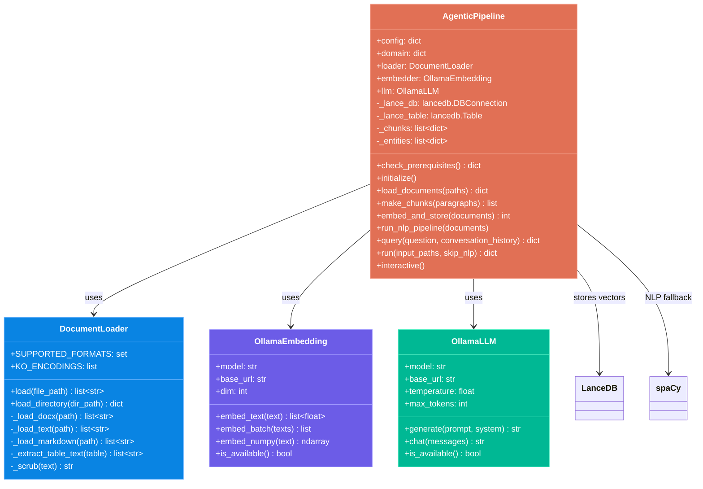
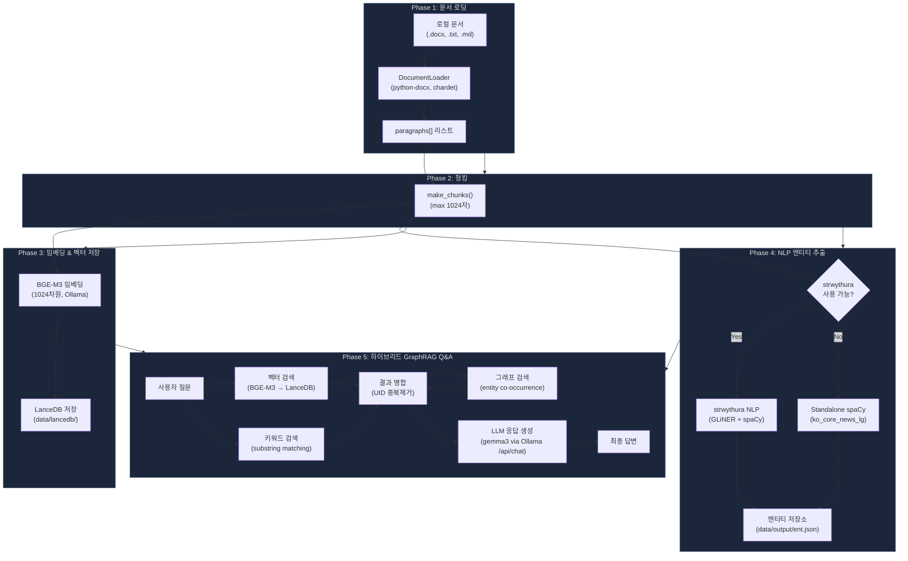
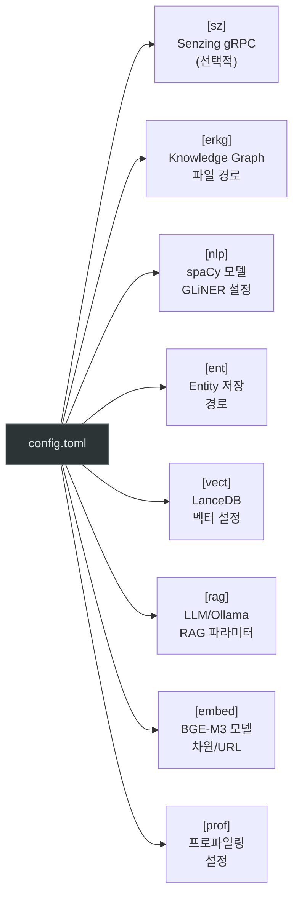
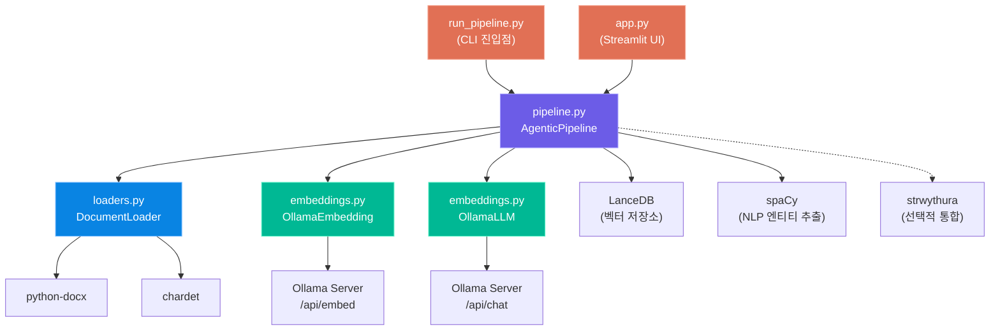
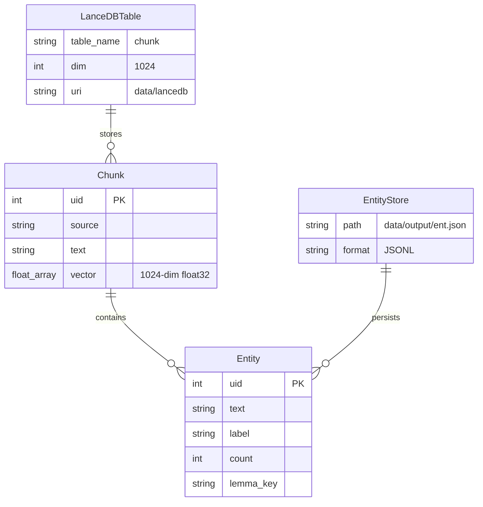

# GraphRAG-Senzing 프로젝트 구조 및 흐름도

> **프로젝트명:** GraphRAG-Senzing (Agentic GraphRAG Pipeline)
> **기반 프레임워크:** strwythura v2.0.3 (DerwenAI) - 선택적 통합
> **최종 수정일:** 2026-03-04

---

## 1. 프로젝트 개요

GraphRAG-Senzing은 **로컬 문서(.docx, .txt, .md)를 대상으로 벡터 검색 + 키워드 검색 + 그래프 기반 검색을 결합한 하이브리드 GraphRAG Q&A 시스템**입니다.
strwythura 프레임워크를 선택적으로 활용하되, strwythura 없이도 독립적으로 동작하는 커스텀 파이프라인을 제공합니다.

### 핵심 기술 스택

| 분류 | 기술 | 비고 |
|------|------|------|
| LLM | Ollama (gemma3:4b/27b) | `/api/chat` 엔드포인트 사용 |
| Embeddings | BGE-M3 via Ollama | 1024차원, 다국어 지원 |
| Vector Store | LanceDB | 파일 기반, 서버 불필요 |
| 문서 로딩 | python-docx, chardet | .docx, .txt, .md 지원 |
| NLP/NER | spaCy (ko_core_news_lg) | 한국어 우선, 영어 fallback |
| Graph | NetworkX (인메모리) | strwythura 연동 시 ERKG 활용 |
| Web UI | Streamlit | 문서 업로드 + Q&A 채팅 |
| Profiling | pyinstrument | 선택적 성능 프로파일링 |
| HTTP Client | httpx | Ollama API 통신 |

---

## 2. 디렉토리 및 파일 구조

```mermaid
graph TD
    ROOT["GraphRAG-Senzing/ (root)"]

    ROOT --> SRC["src/ (핵심 소스)"]
    ROOT --> TESTS["tests/ (테스트)"]
    ROOT --> DATA["data/ (데이터)"]
    ROOT --> DOCS["docs/ (문서)"]
    ROOT --> TOOLS["tools/ (유틸리티)"]
    ROOT --> ENTRY["진입점 & 설정"]

    SRC --> S1["pipeline.py<br/>AgenticPipeline 오케스트레이터"]
    SRC --> S2["loaders.py<br/>DocumentLoader (docx/txt/md)"]
    SRC --> S3["embeddings.py<br/>OllamaEmbedding + OllamaLLM"]

    TESTS --> T1["test_integration.py<br/>통합 테스트 (25개)"]

    DATA --> D1["documents/<br/>입력 문서"]
    DATA --> D2["lancedb/<br/>벡터 저장소 (자동생성)"]
    DATA --> D3["output/<br/>엔티티/그래프 (자동생성)"]
    DATA --> D4["cache/<br/>스크래퍼 캐시"]
    DATA --> D5["uploads/<br/>Streamlit 업로드"]

    ENTRY --> E1["run_pipeline.py<br/>CLI 실행기"]
    ENTRY --> E2["app.py<br/>Streamlit Web UI"]
    ENTRY --> E3["config.toml<br/>전체 설정"]
    ENTRY --> E4["domain.json<br/>도메인 메타데이터"]
    ENTRY --> E5["setup.sh<br/>환경 설정 스크립트"]

    style ROOT fill:#1a1a2e,stroke:#e94560,color:#fff
    style SRC fill:#16213e,stroke:#0f3460,color:#fff
    style DATA fill:#0f3460,stroke:#533483,color:#fff
    style ENTRY fill:#533483,stroke:#e94560,color:#fff
```



### 실제 파일 트리

```
GraphRAG-Senzing/
├── src/
│   ├── __init__.py
│   ├── pipeline.py          ← AgenticPipeline (메인 오케스트레이터)
│   ├── loaders.py           ← DocumentLoader (docx/txt/md, 한글 인코딩)
│   └── embeddings.py        ← OllamaEmbedding + OllamaLLM 클라이언트
├── tests/
│   ├── __init__.py
│   └── test_integration.py  ← 통합 테스트 25개
├── tools/
│   ├── search_debug.py      ← 검색 디버깅 도구
│   └── visualize_graph.py   ← 그래프 시각화 도구
├── data/
│   ├── documents/           ← 입력 문서 (.docx, .txt, .md)
│   ├── lancedb/             ← LanceDB 벡터 저장소
│   ├── output/              ← ent.json, lex.json, erkg.json
│   ├── cache/               ← 스크래퍼 캐시
│   └── uploads/             ← Streamlit 파일 업로드
├── docs/                    ← 분석 문서
├── app.py                   ← Streamlit 웹 UI
├── run_pipeline.py          ← CLI 실행기
├── config.toml              ← 전체 설정 파일
├── domain.json              ← 도메인 메타데이터
├── pyproject.toml           ← 패키지 정의
├── requirements.txt         ← 의존성 목록
├── setup.sh                 ← 환경 설정 스크립트
└── README.md
```

---

## 3. 핵심 모듈 상세 구조



---

## 4. 전체 파이프라인 흐름도



---

## 5. 실행 방법 요약

| 방법 | 명령어 | 설명 |
|------|--------|------|
| CLI 기본 | `python run_pipeline.py data/documents/` | 문서 처리 → 대화형 Q&A |
| 특정 파일 | `python run_pipeline.py report.docx notes.txt` | 지정 파일만 처리 |
| NLP 건너뛰기 | `python run_pipeline.py --skip-nlp data/documents/` | 벡터 검색만 (빠른 모드) |
| 단일 질문 | `python run_pipeline.py data/documents/ --query "질문"` | 질문 후 종료 |
| Q&A만 | `python run_pipeline.py --query-only` | 기존 데이터로 Q&A |
| 상태 확인 | `python run_pipeline.py --check` | Ollama/모델 확인 |
| Streamlit | `streamlit run app.py` | 웹 UI 실행 |

---

## 6. 설정 파일 구조 (config.toml)



### 현재 주요 설정값

| 섹션 | 키 | 값 | 설명 |
|------|-----|-----|------|
| `[rag]` | `lm_name` | `ollama_chat/gemma3:4b` | LLM 모델 |
| `[rag]` | `api_base` | `http://192.168.68.68:11434` | Ollama 서버 |
| `[rag]` | `temperature` | `0.0` | 결정적 응답 |
| `[rag]` | `max_tokens` | `3000` | 최대 응답 토큰 |
| `[rag]` | `max_chunks` | `11` | 검색 최대 청크 수 |
| `[embed]` | `model` | `bge-m3:latest` | 임베딩 모델 |
| `[embed]` | `dim` | `1024` | 임베딩 차원 |
| `[nlp]` | `spacy_model` | `ko_core_news_lg` | spaCy 모델 |
| `[vect]` | `chunk_size` | `1024` | 청크 최대 문자 수 |

---

## 7. 모듈 의존성 맵



---

## 8. 핵심 데이터 모델



---

## 9. strwythura 통합 관계

현재 프로젝트는 strwythura를 **선택적 의존성**으로 취급합니다.

```mermaid
flowchart LR
    subgraph INDEPENDENT["독립 동작 (strwythura 없이)"]
        LOADER["DocumentLoader"]
        BGE["OllamaEmbedding<br/>(BGE-M3)"]
        LANCE["LanceDB"]
        SPACY["Standalone spaCy<br/>NER"]
        LLM["OllamaLLM<br/>(gemma3)"]
    end

    subgraph OPTIONAL["선택적 통합 (strwythura 있을 때)"]
        STRW_WORK["strwythura.Workflow"]
        STRW_PARSE["Parser (GLiNER + spaCy)"]
        STRW_LEX["LexicalGraph (TextRank)"]
        STRW_ERKG["KnowledgeGraph (ERKG)"]
        STRW_RAG["GraphRAG (DSPy)"]
    end

    INDEPENDENT -.->|"fallback"| OPTIONAL

    style INDEPENDENT fill:#00b894,stroke:#55efc4,color:#fff
    style OPTIONAL fill:#636e72,stroke:#b2bec3,color:#fff
```



| 기능 | strwythura 없을 때 | strwythura 있을 때 |
|------|-------------------|-------------------|
| NLP 엔티티 추출 | standalone spaCy NER | GLiNER + spaCy 통합 |
| 그래프 | entity co-occurrence 기반 | ERKG + LexicalGraph |
| LLM 호출 | Ollama /api/chat 직접 | DSPy RAG Signature |
| Q&A | 하이브리드 검색 (벡터+키워드+그래프) | Enhanced GraphRAG |
