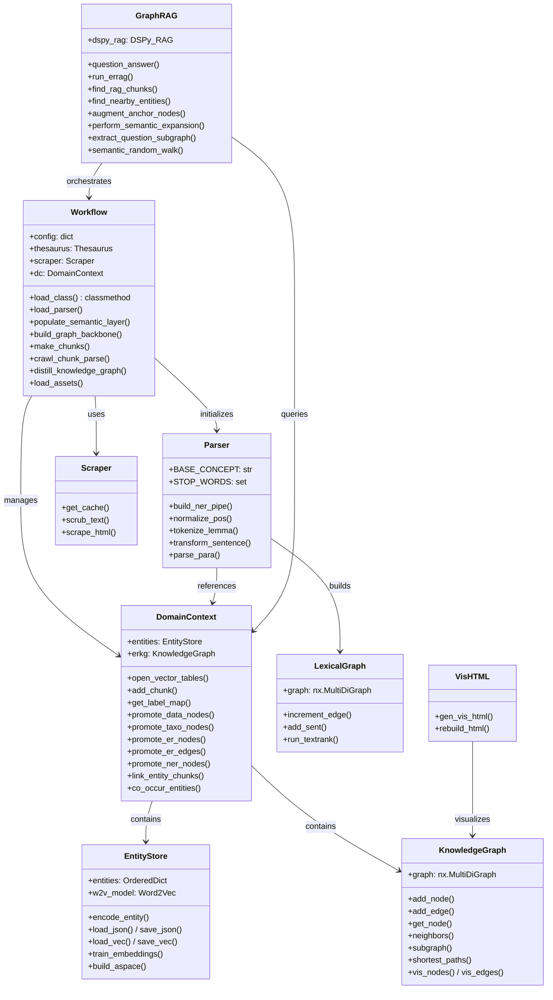
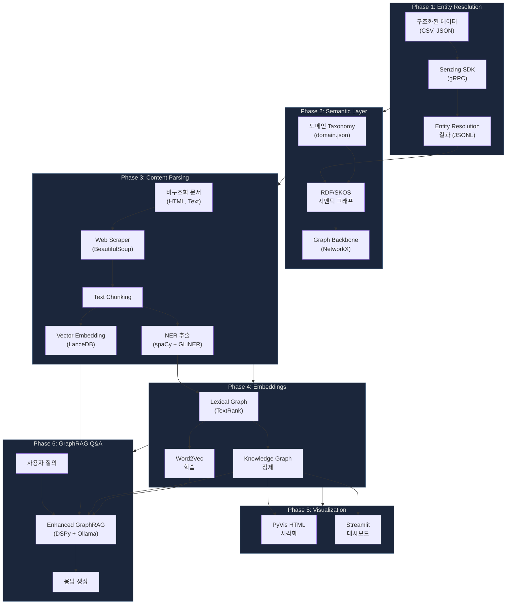
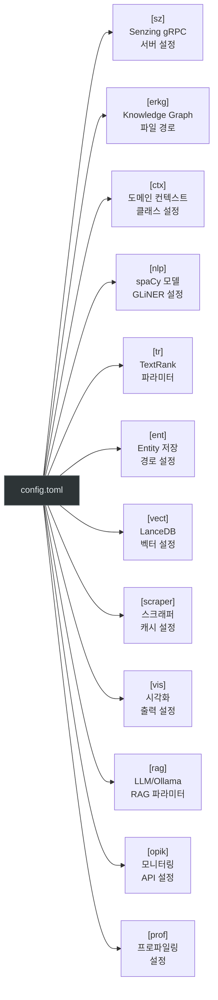
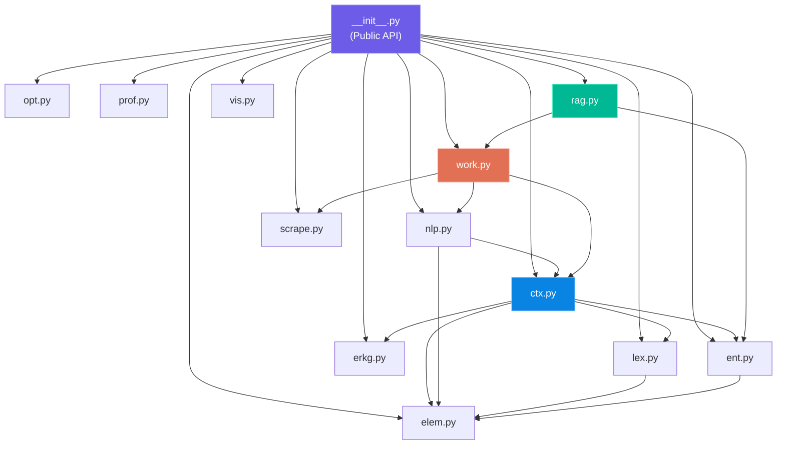
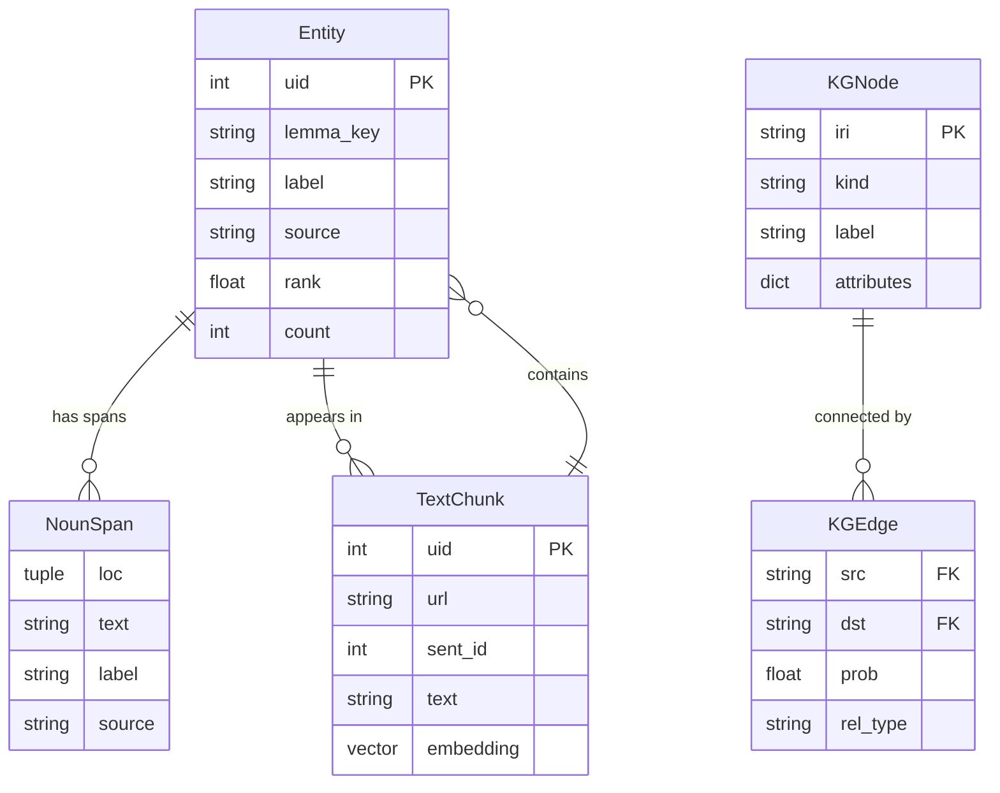

# Strwythura 프로젝트 구조 및 흐름도 분석

> **프로젝트명:** Strwythura (Entity-Resolved Knowledge Graph)
> **버전:** 2.0.3
> **라이선스:** MIT
> **작성자:** Paco Nathan (DerwenAI)
> **분석일:** 2026-02-27

---

## 1. 프로젝트 개요

Strwythura는 **구조화된 데이터와 비구조화된 데이터를 결합하여 Entity-Resolved Knowledge Graph를 구축**하는 Python 프레임워크입니다. "Context Engineering"을 통해 특정 도메인에 최적화된 AI 애플리케이션을 지원하며, GraphRAG(Graph-based Retrieval Augmented Generation) 파이프라인을 제공합니다.

### 핵심 기술 스택

| 분류 | 기술 |
|------|------|
| Entity Resolution | Senzing SDK (gRPC) |
| NLP/NER | spaCy, GLiNER, DSPy |
| Graph | NetworkX, RDFlib |
| Vector Store | LanceDB |
| Embeddings | Gensim Word2Vec, ArrowSpace |
| LLM | Ollama (Gemma3) |
| Visualization | PyVis, Streamlit |
| Observability | Opik, pyinstrument |

---

## 2. 디렉토리 및 파일 구조

```mermaid
graph TD
    ROOT["strwythura/ (root)"]

    ROOT --> CONFIG["설정 파일"]
    ROOT --> PIPELINE["파이프라인 스크립트"]
    ROOT --> PKG["strwythura/ (패키지)"]
    ROOT --> MISC["기타 파일"]

    CONFIG --> CT["config.toml"]
    CONFIG --> DJ["domain.json"]
    CONFIG --> PP["pyproject.toml"]

    PIPELINE --> P1["1_er.py<br/>Entity Resolution"]
    PIPELINE --> P2["2_sem.py<br/>Semantic Layer"]
    PIPELINE --> P3["3_parse.py<br/>Content Parsing"]
    PIPELINE --> P5["5_embed.py<br/>Embeddings"]
    PIPELINE --> P6["6_vis.py<br/>Visualization"]
    PIPELINE --> P7["7_errag.py<br/>GraphRAG"]
    PIPELINE --> PA["app.py<br/>Streamlit UI"]

    PKG --> INIT["__init__.py"]
    PKG --> CTX["ctx.py - DomainContext"]
    PKG --> ELEM["elem.py - Elements/Models"]
    PKG --> ENT["ent.py - EntityStore"]
    PKG --> ERKG["erkg.py - KnowledgeGraph"]
    PKG --> LEX["lex.py - LexicalGraph"]
    PKG --> NLP["nlp.py - Parser"]
    PKG --> OPT["opt.py - Optimization"]
    PKG --> PROF["prof.py - Profiler"]
    PKG --> RAG["rag.py - GraphRAG"]
    PKG --> SCRAPE["scrape.py - Scraper"]
    PKG --> VIS["vis.py - VisHTML"]
    PKG --> WORK["work.py - Workflow"]
    PKG --> RES["resources/ - Templates"]

    MISC --> LK["poetry.lock"]
    MISC --> LT["lint.sh"]
    MISC --> GI[".gitignore"]
    MISC --> RM["README.md"]

    style ROOT fill:#1a1a2e,stroke:#e94560,color:#fff
    style PKG fill:#16213e,stroke:#0f3460,color:#fff
    style PIPELINE fill:#0f3460,stroke:#533483,color:#fff
    style CONFIG fill:#533483,stroke:#e94560,color:#fff
```

---

## 3. 핵심 모듈 상세 구조

---

## 4. 전체 파이프라인 흐름도

---

## 5. 파이프라인 스크립트별 실행 순서

| 단계 | 스크립트 | 역할 | 입력 | 출력 |
|------|----------|------|------|------|
| 1 | `1_er.py` | Entity Resolution | 구조화 데이터셋 | ER 결과 (JSONL) |
| 2 | `2_sem.py` | Semantic Layer 구축 | ER 결과 + Taxonomy | Thesaurus (TTL), ERKG, EntityStore |
| 3 | `3_parse.py` | 문서 파싱 & NER | 웹 문서/텍스트 | 벡터 임베딩, 엔티티, Lexical Graph |
| - | (4단계: Human-in-the-Loop) | 수동 큐레이션 | 추출된 엔티티 | 교정된 엔티티 |
| 5 | `5_embed.py` | 임베딩 학습 & KG 정제 | Lexical Graph + EntityStore | Word2Vec 모델, 정제된 ERKG |
| 6 | `6_vis.py` | 시각화 | ERKG | HTML 시각화 파일 |
| 7 | `7_errag.py` | GraphRAG Q&A | 모든 자산 | 대화형 Q&A |
| - | `app.py` | Streamlit 웹 UI | 모든 자산 | 웹 대시보드 |

---

## 6. 설정 파일 구조 (config.toml)

---

## 7. 모듈 의존성 맵

---

## 8. 핵심 데이터 모델

이 문서는 Strwythura 프로젝트의 전체 구조, 모듈 구성, 파이프라인 흐름을 정리한 것입니다. 다음 문서에서는 블록 다이어그램과 시퀀스 다이어그램을 통해 세부 동작을 분석합니다.
