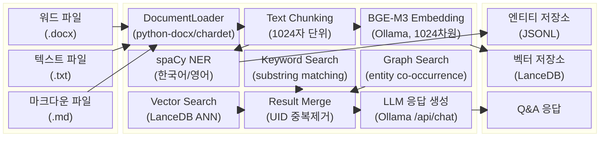
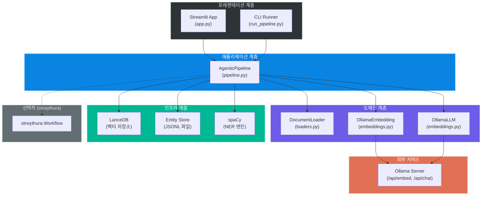
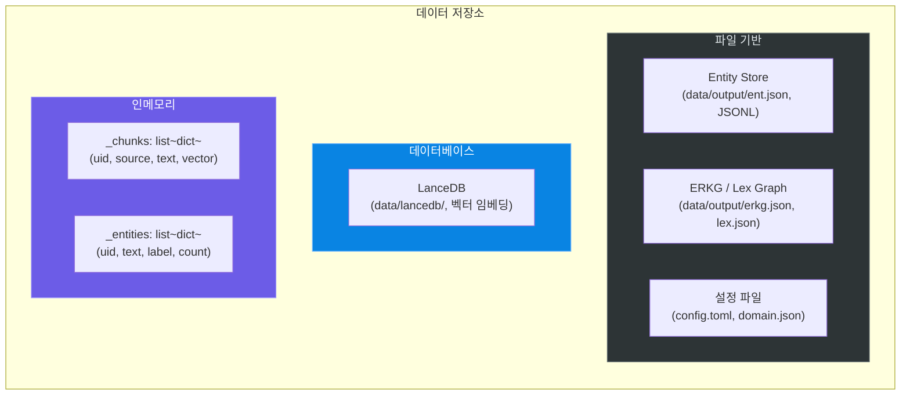
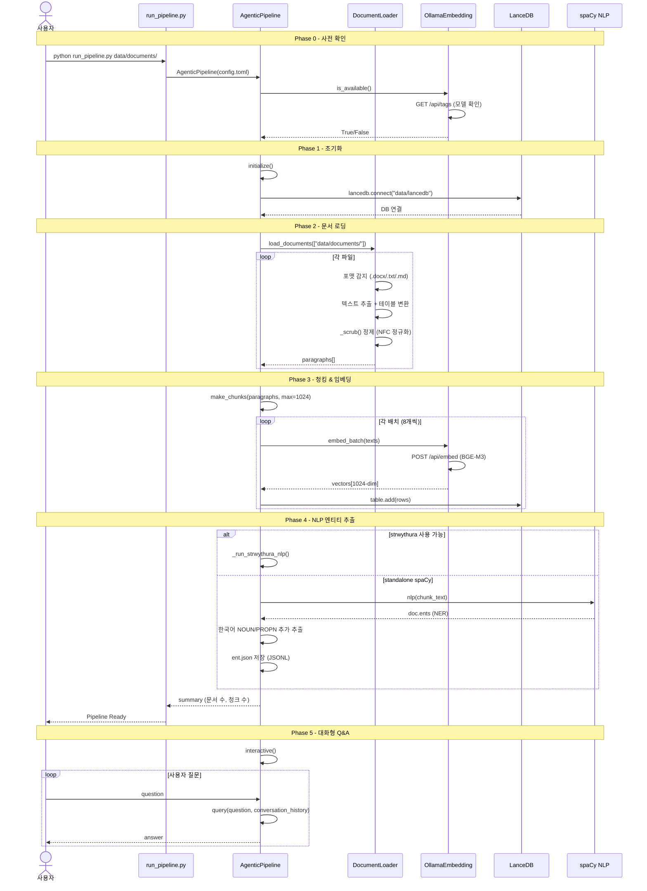
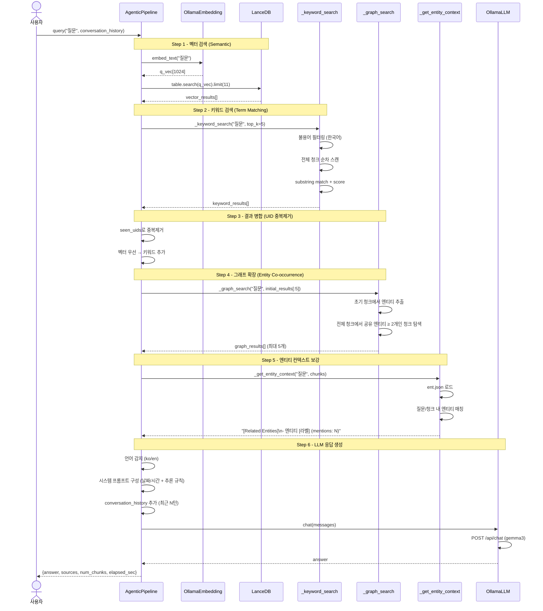
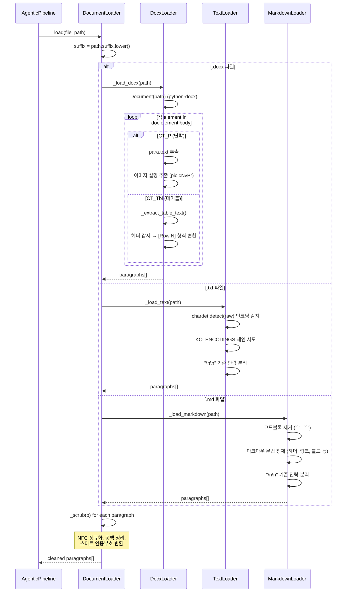
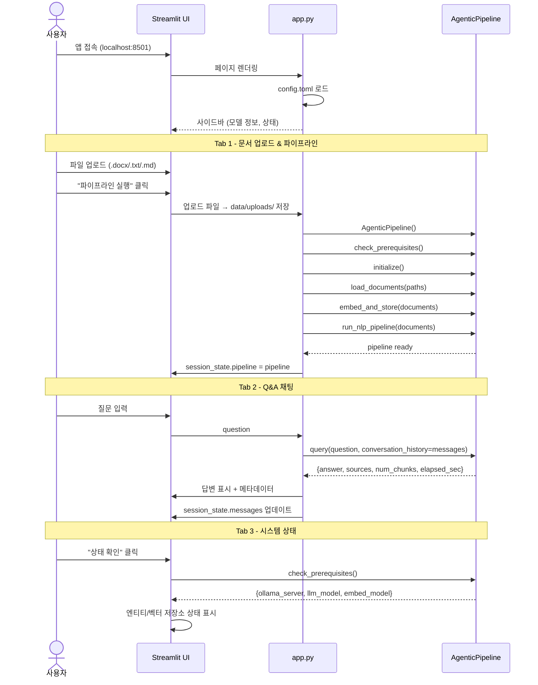
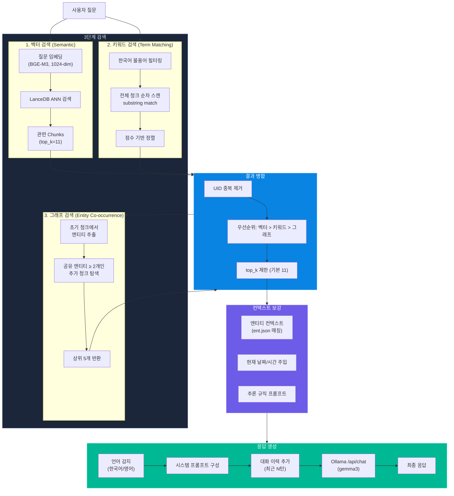
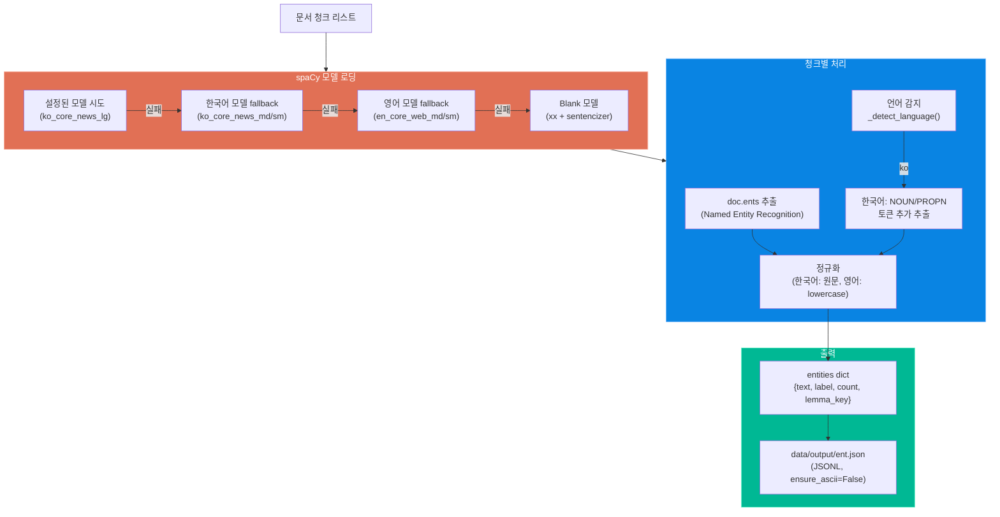
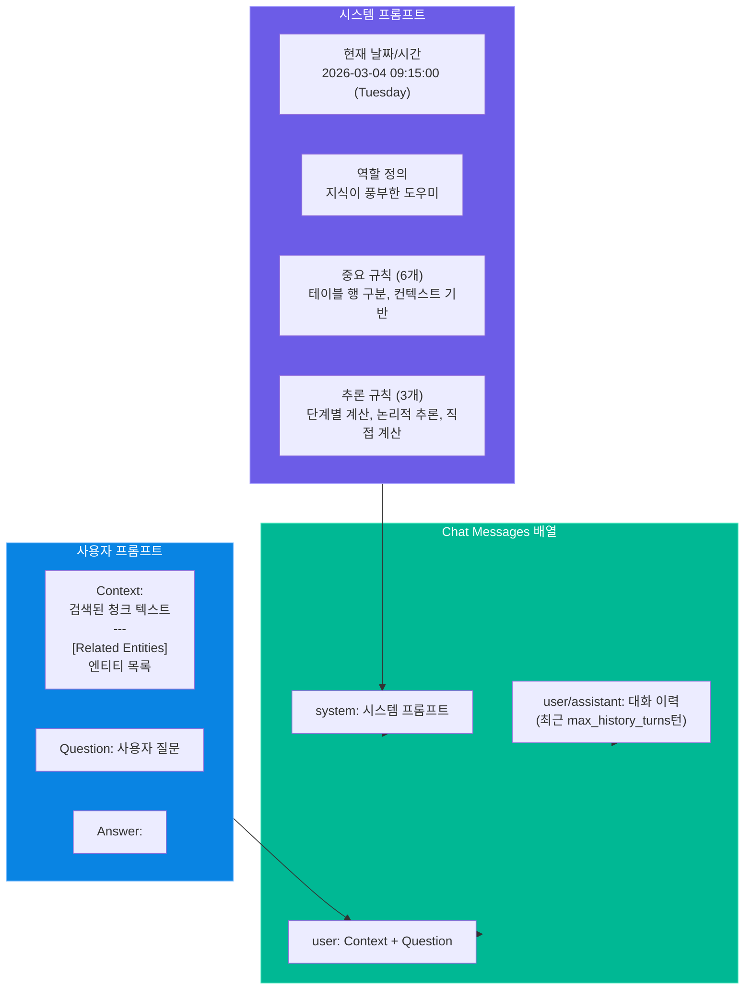

# GraphRAG-Senzing 블록 다이어그램 및 시퀀스 다이어그램

> **프로젝트:** GraphRAG-Senzing (Agentic GraphRAG Pipeline)
> **최종 수정일:** 2026-03-04

---

## 1. 시스템 아키텍처 블록 다이어그램

---

## 2. 컴포넌트 블록 다이어그램

### 2.1 핵심 계층 구조

### 2.2 데이터 저장소 블록 구조

---

## 3. 시퀀스 다이어그램

### 3.1 전체 파이프라인 실행 시퀀스 (run)

### 3.2 하이브리드 GraphRAG 질의응답 시퀀스 (query)

### 3.3 문서 로딩 상세 시퀀스

### 3.4 Streamlit App 사용자 인터랙션 시퀀스

---

## 4. 하이브리드 검색 파이프라인 블록 다이어그램

---

## 5. NLP 엔티티 추출 흐름 (standalone spaCy)

---

## 6. LLM 프롬프트 구조

