# Strwythura 블록 다이어그램 및 시퀀스 다이어그램

> **분석 대상:** DerwenAI/strwythura v2.0.3
> **분석일:** 2026-02-27

---

## 1. 시스템 아키텍처 블록 다이어그램

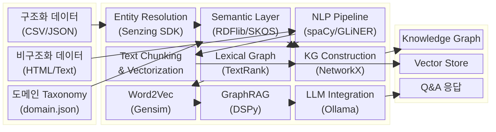

---

## 2. 컴포넌트 블록 다이어그램

### 2.1 핵심 계층 구조

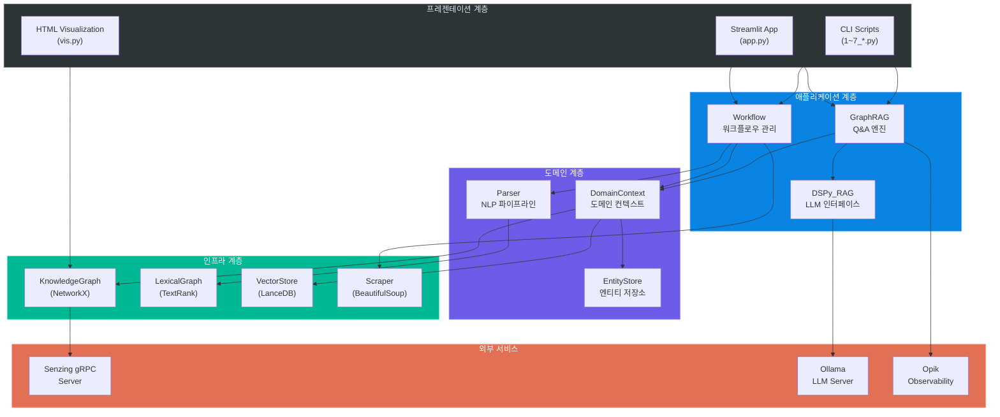

### 2.2 데이터 저장소 블록 구조

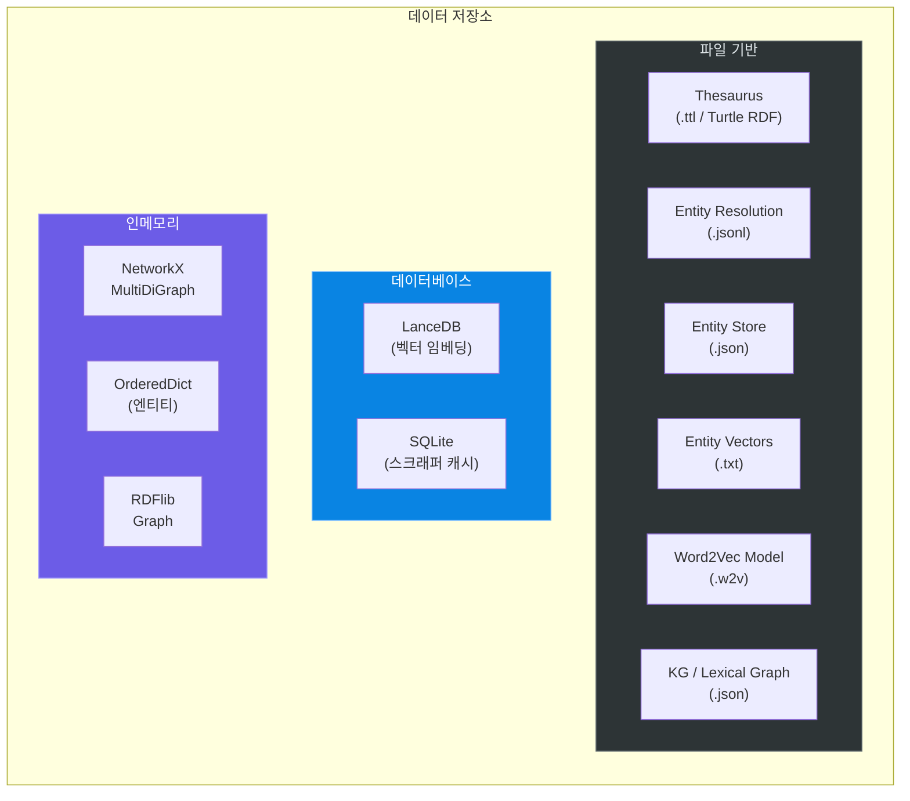

---

## 3. 시퀀스 다이어그램

### 3.1 전체 파이프라인 실행 시퀀스

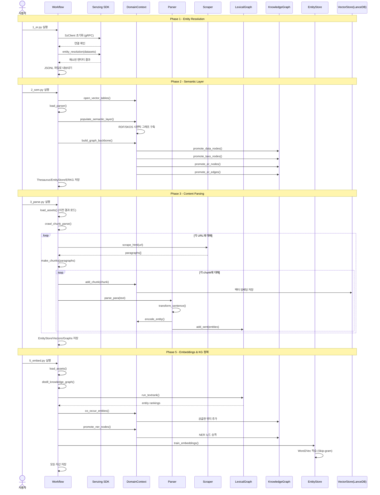

### 3.2 GraphRAG 질의응답 시퀀스

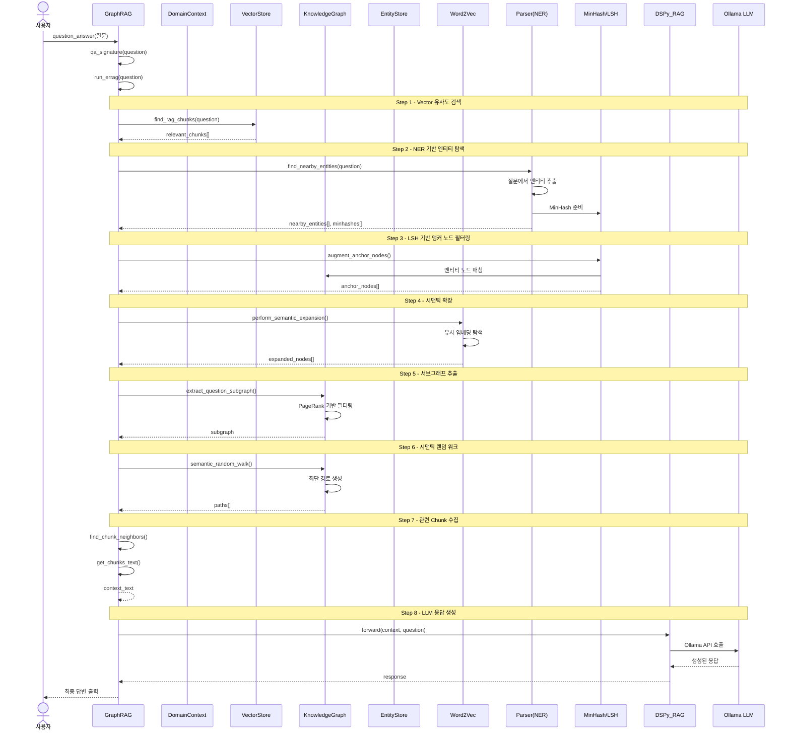

### 3.3 Entity Resolution 상세 시퀀스

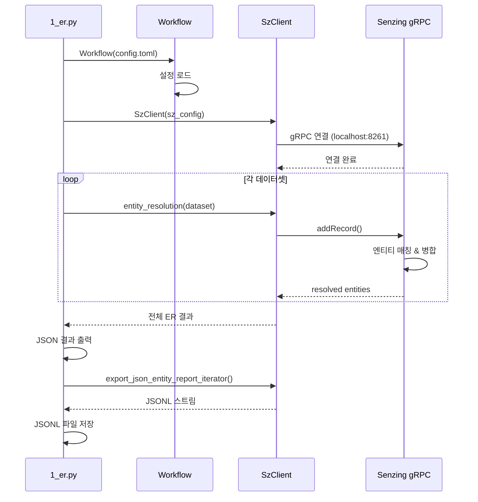

### 3.4 Content Parsing 상세 시퀀스

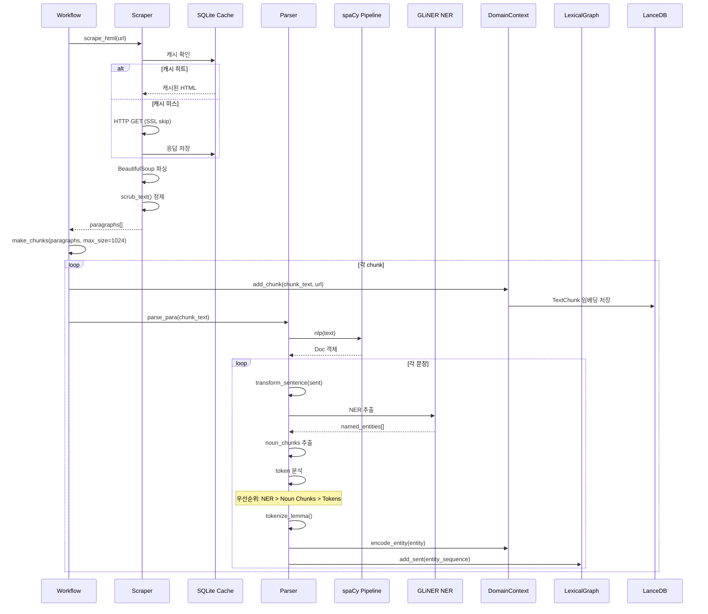

### 3.5 Streamlit App 사용자 인터랙션 시퀀스

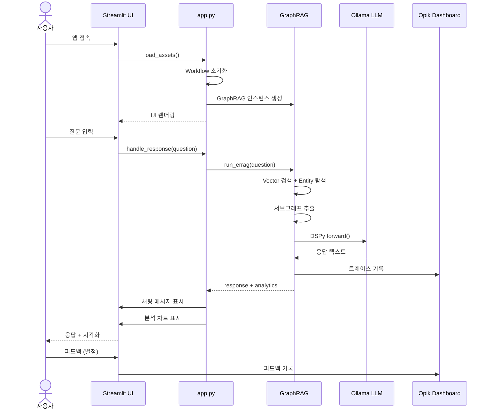

---

## 4. TextRank 알고리즘 블록 다이어그램

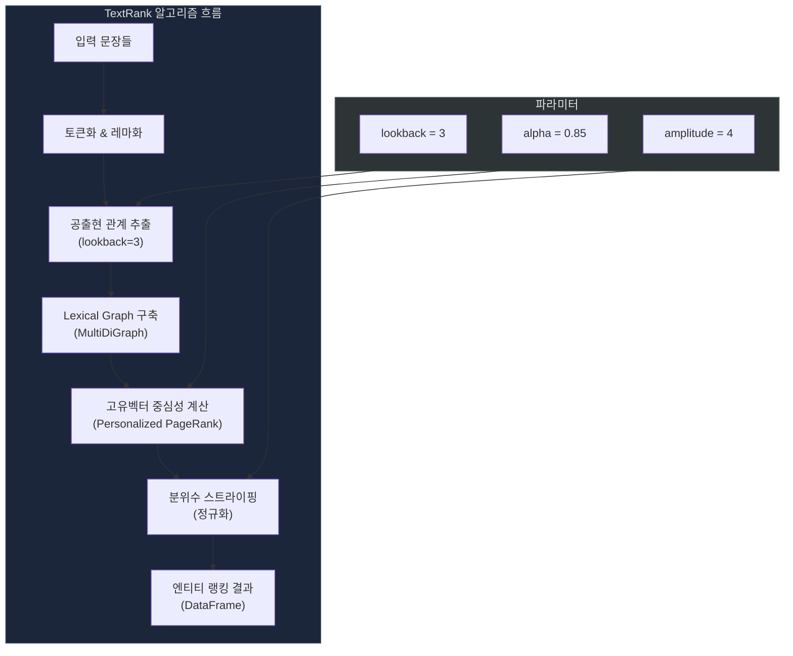

---

## 5. Enhanced GraphRAG 검색 파이프라인 블록 다이어그램

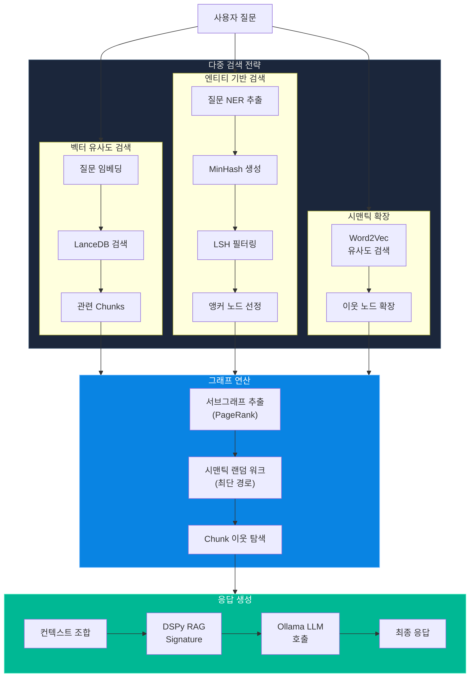

---

## 6. 엔티티 처리 우선순위 블록 다이어그램

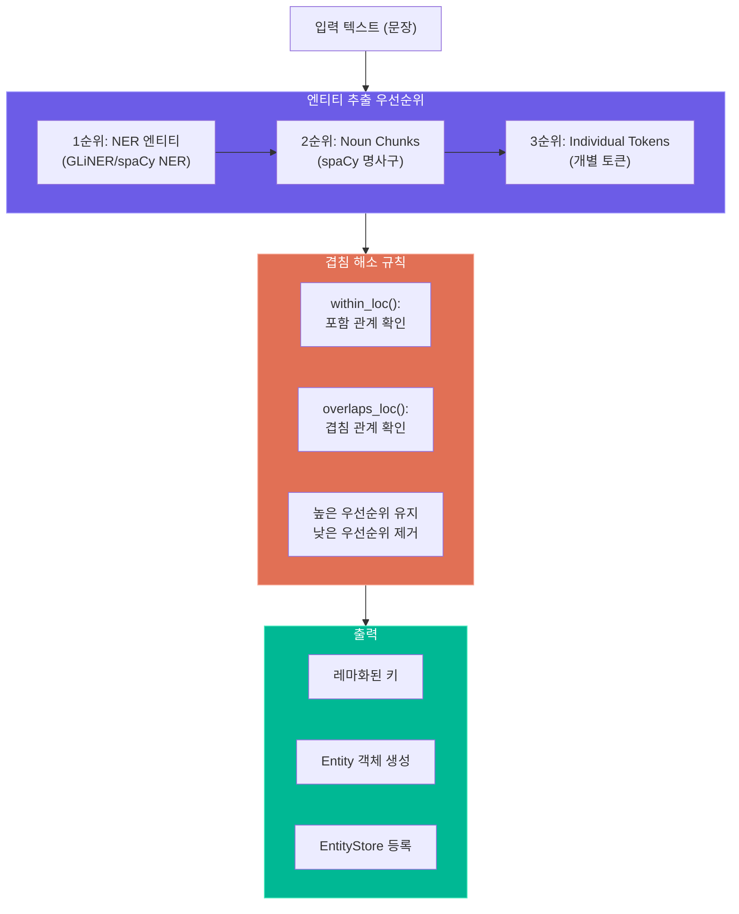

이 문서는 Strwythura의 주요 컴포넌트 간 상호작용과 데이터 흐름을 시퀀스/블록 다이어그램으로 상세히 분석한 자료입니다.
