# Strwythura 사용자 및 데이터 워크플로우 분석

> **분석 대상:** DerwenAI/strwythura v2.0.3
> **분석일:** 2026-02-27

---

## 1. 사용자 워크플로우 전체 흐름

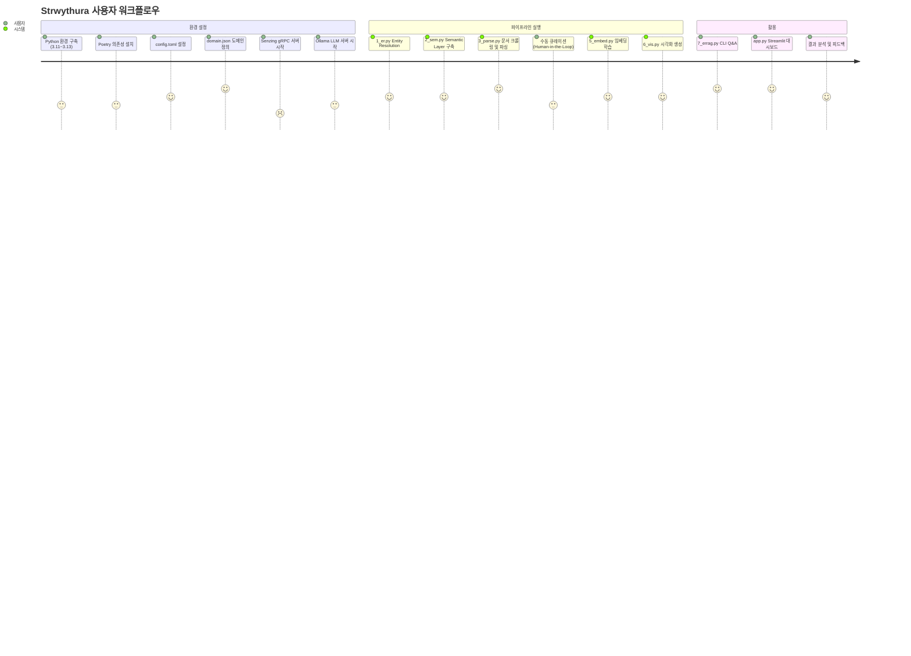

---

## 2. 사용자 역할별 워크플로우

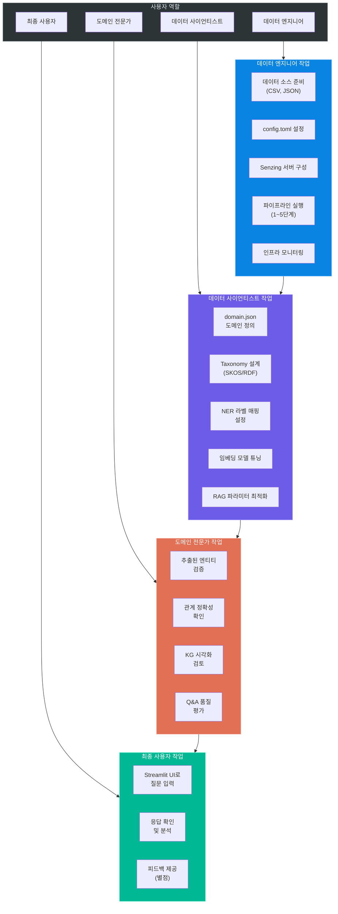

---

## 3. 데이터 워크플로우 상세 분석

### 3.1 전체 데이터 라이프사이클

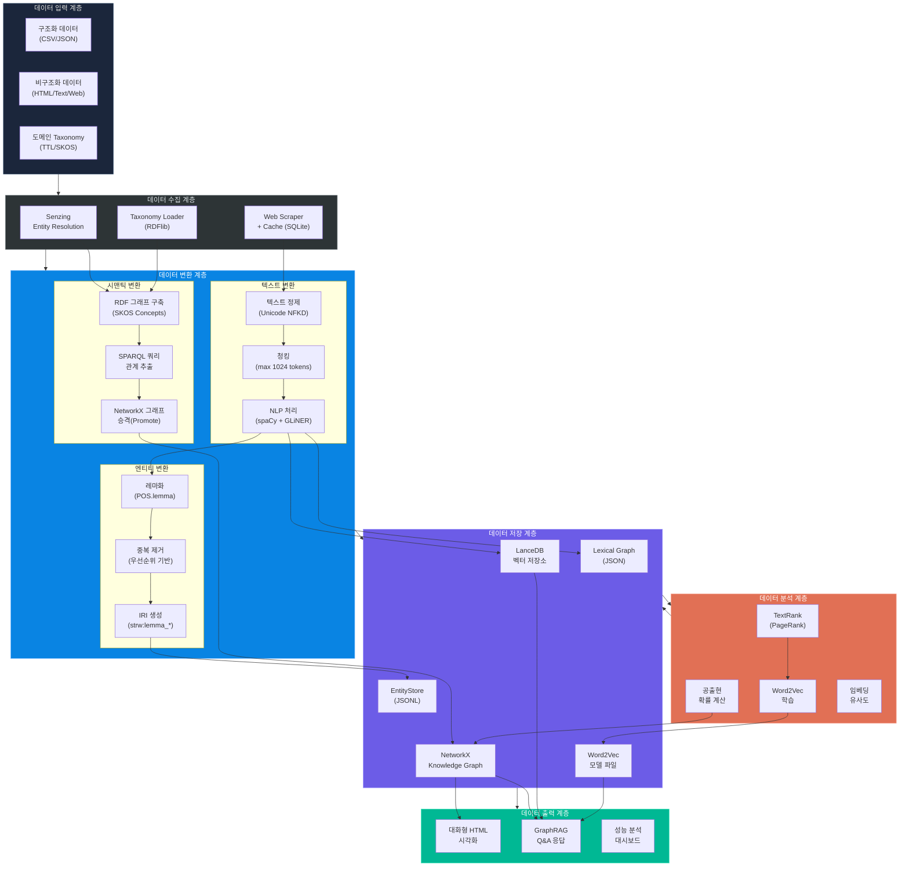

### 3.2 데이터 포맷 변환 흐름

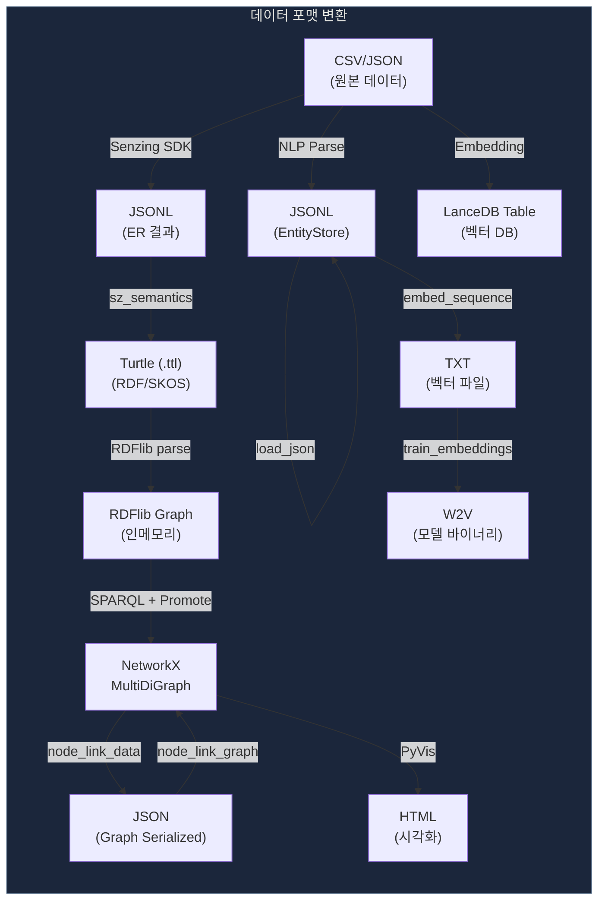

---

## 4. 핵심 데이터 처리 워크플로우

### 4.1 텍스트 청킹 워크플로우

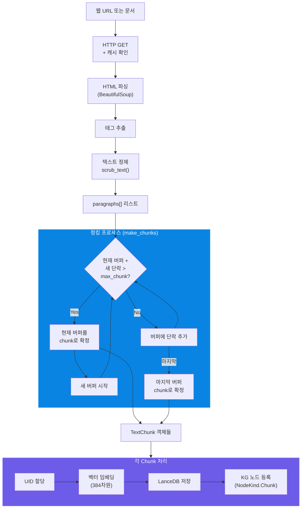

### 4.2 엔티티 추출 및 등록 워크플로우

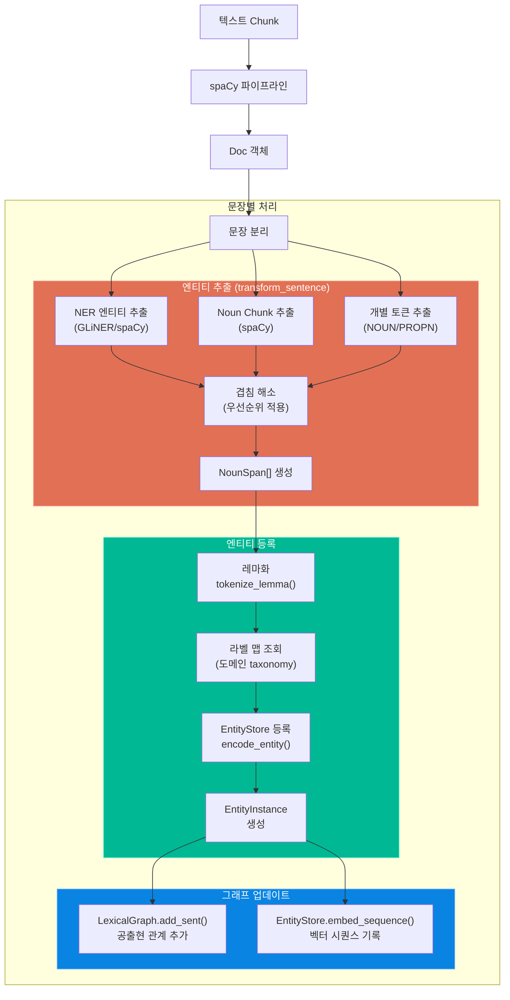

### 4.3 Knowledge Graph 구축 워크플로우

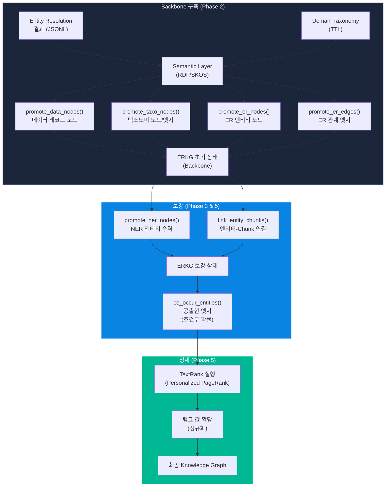

---

## 5. GraphRAG 검색 워크플로우 상세

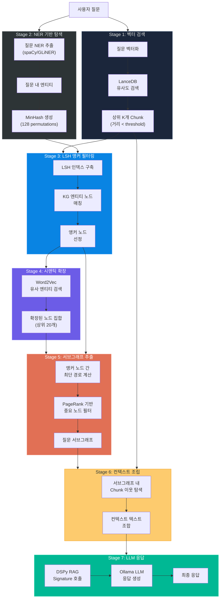

---

## 6. 임베딩 듀얼 전략 워크플로우

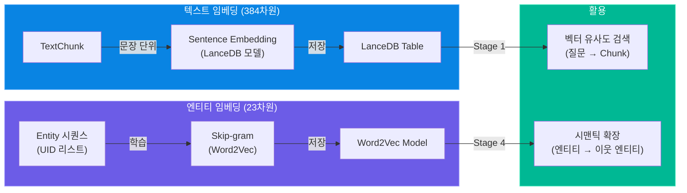

---

## 7. 체크포인트 기반 파이프라인 워크플로우

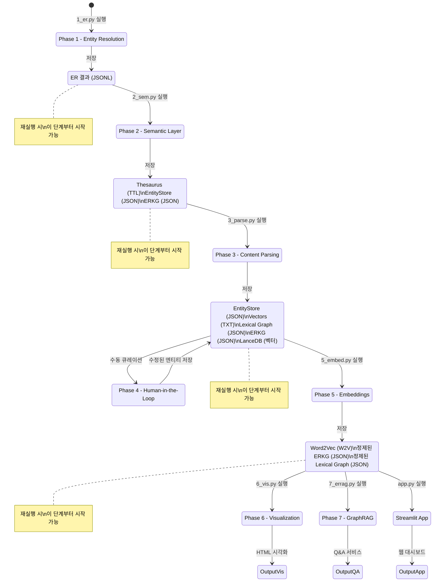

---

## 8. Observability 워크플로우

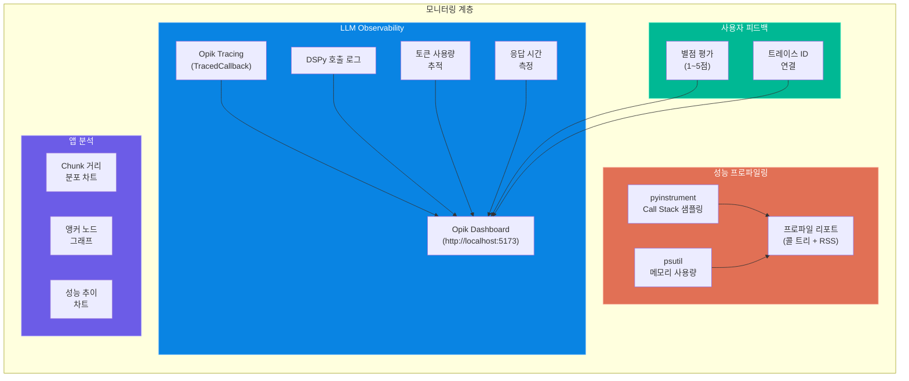

---

## 9. 에러 처리 및 복구 워크플로우

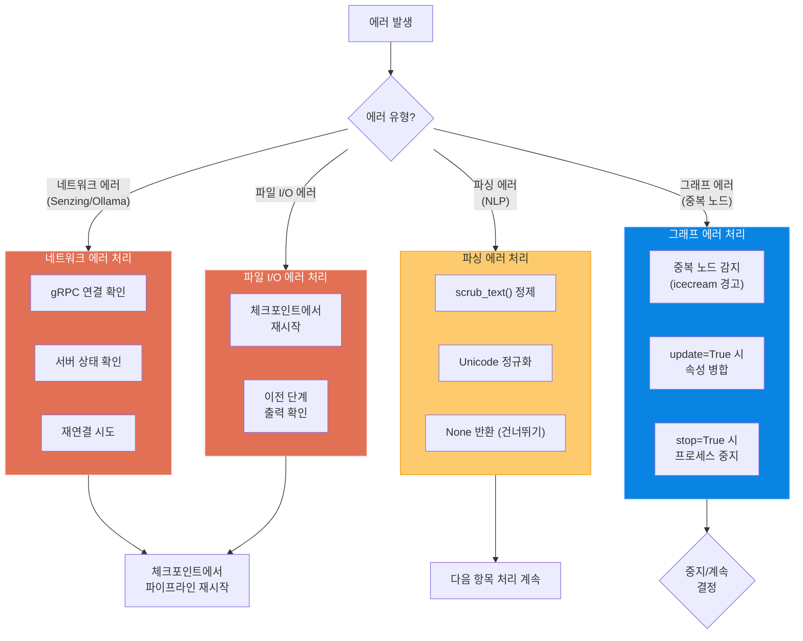

이 문서는 Strwythura의 사용자 관점 및 데이터 관점에서의 워크플로우를 상세히 분석한 자료입니다.
