# GraphRAG-Senzing 사용자 및 데이터 워크플로우

> **프로젝트:** GraphRAG-Senzing (Agentic GraphRAG Pipeline)
> **최종 수정일:** 2026-03-04

---

## 1. 사용자 워크플로우 전체 흐름

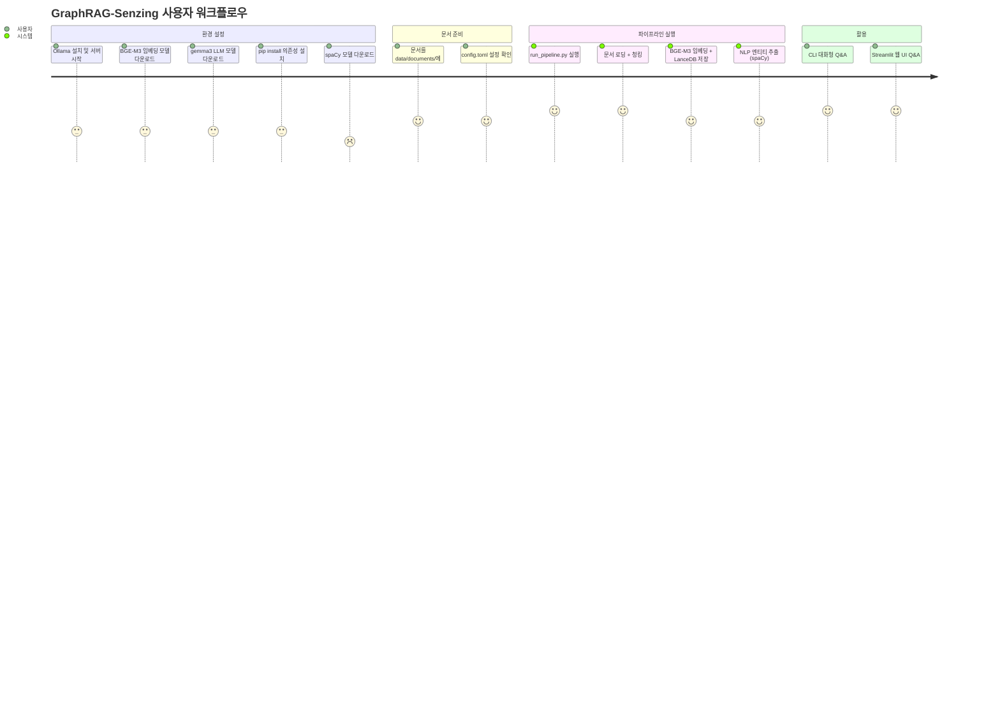

---

## 2. 사용자 역할별 워크플로우

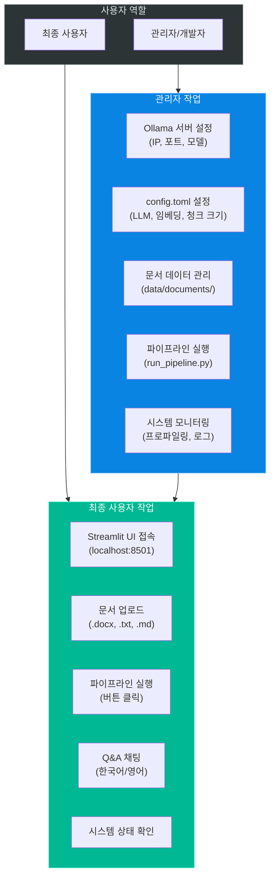

---

## 3. 데이터 워크플로우 상세

### 3.1 전체 데이터 라이프사이클

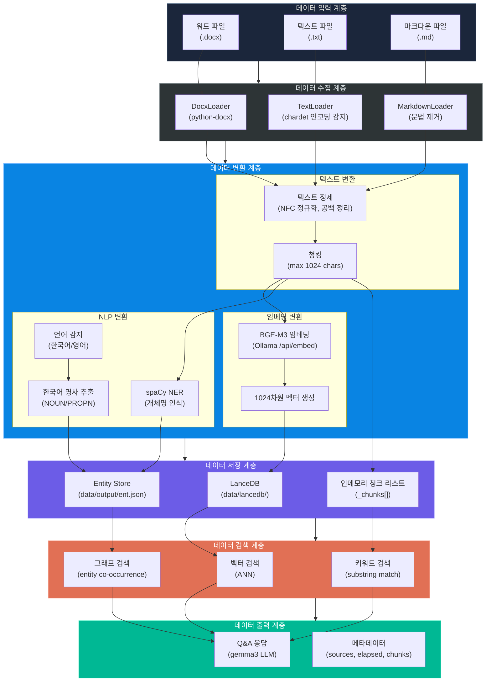

### 3.2 데이터 포맷 변환 흐름

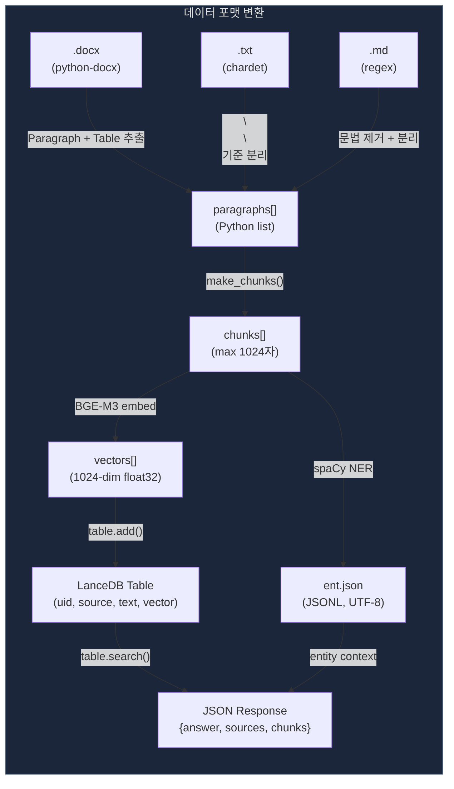

---

## 4. 핵심 데이터 처리 워크플로우

### 4.1 텍스트 청킹 워크플로우

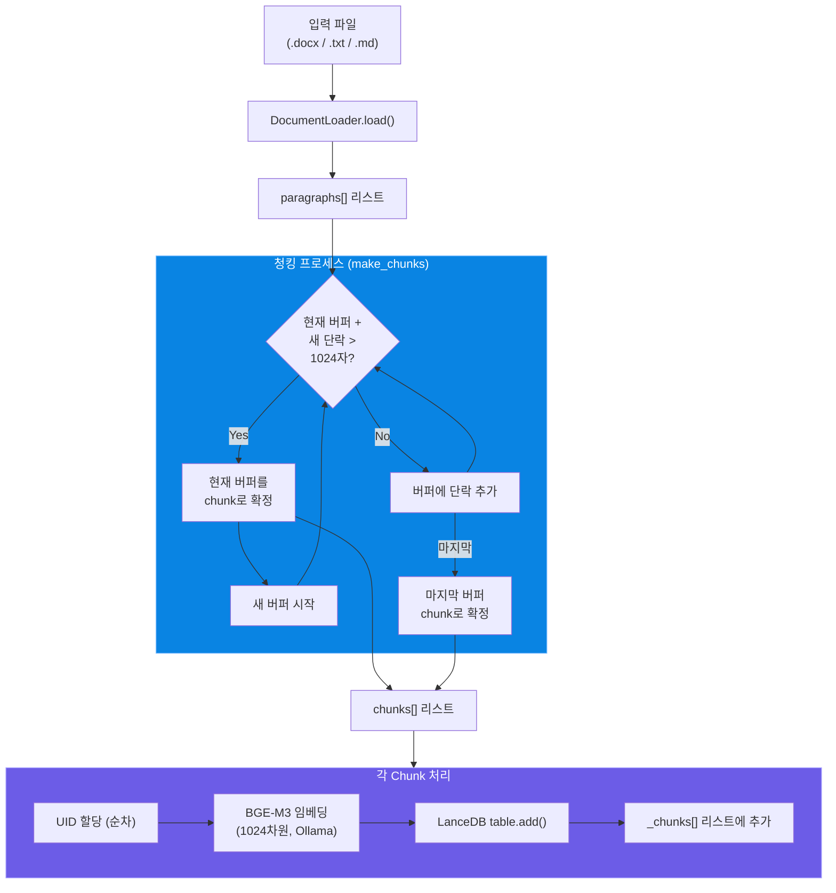

### 4.2 워드 파일 테이블 처리 워크플로우

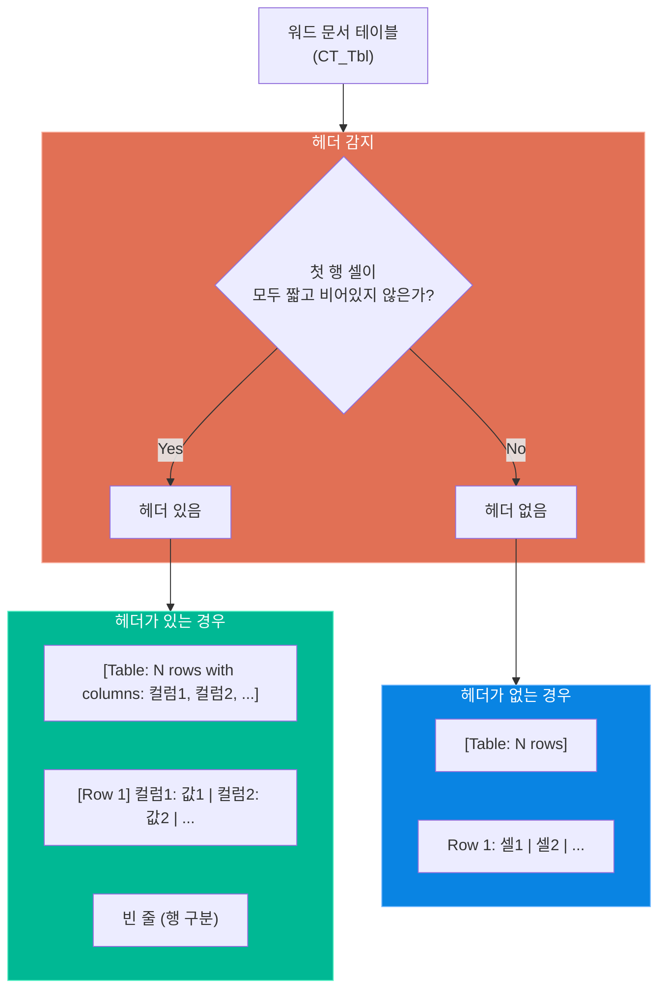

### 4.3 엔티티 추출 워크플로우 (standalone spaCy)

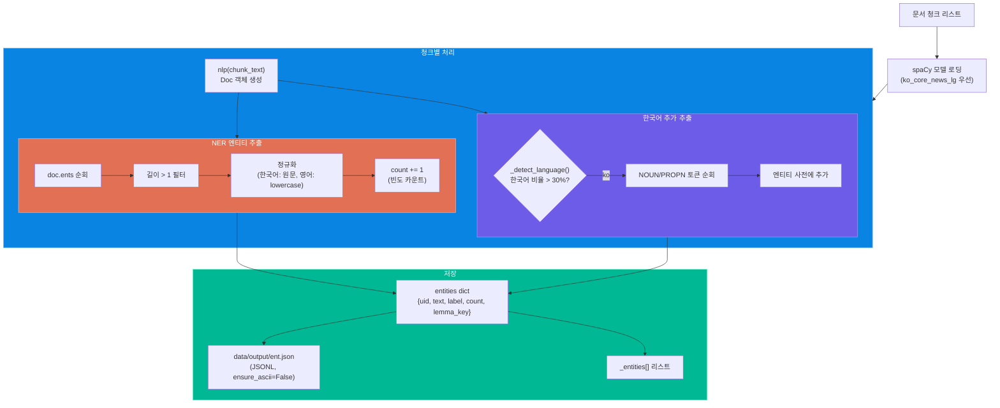

---

## 5. GraphRAG 검색 워크플로우 상세

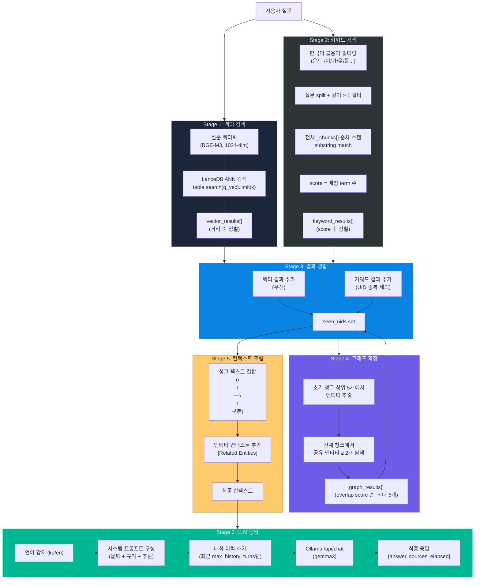

---

## 6. 대화 메모리 워크플로우

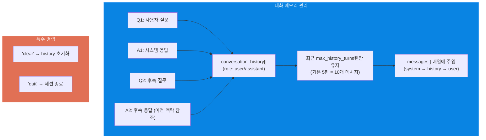

---

## 7. 에러 처리 및 복구 워크플로우

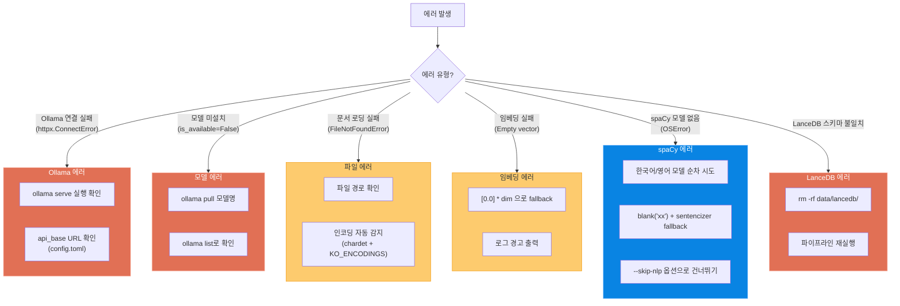

---

## 8. 프로파일링 워크플로우

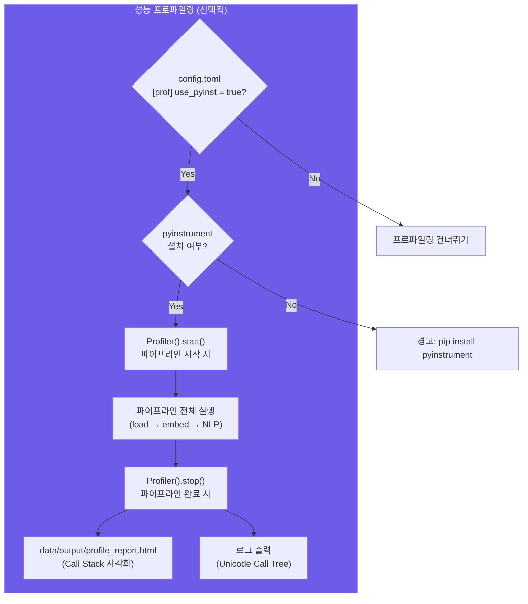
