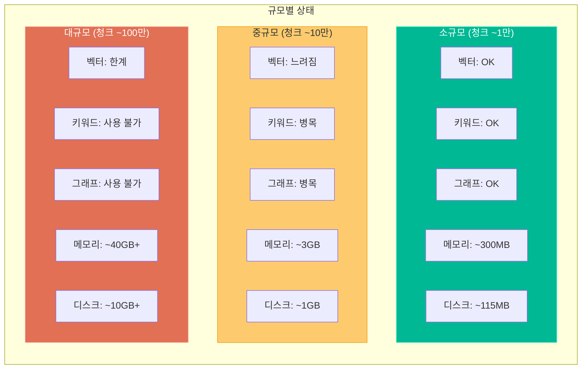

# GraphRAG-Senzing 구현 현황 및 아키텍처 검토

> **프로젝트:** GraphRAG-Senzing (Agentic GraphRAG Pipeline)
> **최종 수정일:** 2026-03-04

---

## 1. 구현 현황 개요

### 1.1 현재 아키텍처

```mermaid
graph TB
    subgraph INPUT["입력 소스 (구현 완료)"]
        DOCX[".docx 파일\n(python-docx)"]
        TXT[".txt 파일\n(chardet 인코딩)"]
        MD[".md 파일\n(regex 정제)"]
    end

    subgraph PROCESSING["처리 파이프라인 (구현 완료)"]
        LOADER["DocumentLoader\n(loaders.py)"]
        CHUNKER["make_chunks()\n(1024자 단위)"]
        EMBEDDER["OllamaEmbedding\n(BGE-M3, 1024-dim)"]
        NLP["spaCy NER\n(ko_core_news_lg)"]
    end

    subgraph STORAGE["저장소 (구현 완료)"]
        LANCE["LanceDB\n(data/lancedb/)"]
        ENT_STORE["Entity Store\n(data/output/ent.json)"]
        CHUNKS_MEM["인메모리 청크 리스트"]
    end

    subgraph SEARCH["검색 엔진 (구현 완료)"]
        VEC["벡터 검색\n(LanceDB ANN)"]
        KW["키워드 검색\n(substring matching)"]
        GRAPH["그래프 검색\n(entity co-occurrence)"]
    end

    subgraph LLM_STACK["LLM 스택 (구현 완료)"]
        CHAT["Ollama /api/chat\n(gemma3:4b/27b)"]
        HISTORY["대화 메모리\n(conversation_history)"]
        PROMPT["시스템 프롬프트\n(날짜/추론 규칙)"]
    end

    subgraph UI["사용자 인터페이스 (구현 완료)"]
        CLI_UI["CLI\n(run_pipeline.py)"]
        WEB_UI["Streamlit\n(app.py)"]
    end

    INPUT --> PROCESSING --> STORAGE --> SEARCH --> LLM_STACK --> UI

    style INPUT fill:#00b894,stroke:#55efc4,color:#fff
    style PROCESSING fill:#00b894,stroke:#55efc4,color:#fff
    style STORAGE fill:#00b894,stroke:#55efc4,color:#fff
    style SEARCH fill:#00b894,stroke:#55efc4,color:#fff
    style LLM_STACK fill:#00b894,stroke:#55efc4,color:#fff
    style UI fill:#00b894,stroke:#55efc4,color:#fff
```

### 1.2 원본 계획 vs 구현 결과

| 항목 | 원본 계획 (strwythura 기반) | 구현 결과 | 상태 |
|------|---------------------------|----------|------|
| **입력 소스** | HTML 웹페이지 (URL) → .docx/.txt/.md 변경 | DocumentLoader 구현 (python-docx, chardet, regex) | 완료 |
| **LLM** | gemma3:27b | gemma3:4b (기본), 27b (선택) | 완료 |
| **임베딩** | LanceDB 내장 (384차원) → BGE-M3 변경 | OllamaEmbedding (BGE-M3, 1024차원) | 완료 |
| **벡터 저장소** | LanceDB | LanceDB (PyArrow 스키마) | 완료 |
| **NLP/NER** | strwythura (GLiNER + spaCy) | standalone spaCy (fallback) + strwythura (선택적) | 완료 |
| **그래프 DB** | NetworkX (strwythura ERKG) | entity co-occurrence 기반 (인메모리) | 완료 |
| **LLM 호출** | DSPy RAG Signature | Ollama /api/chat 직접 호출 | 완료 |
| **키워드 검색** | 미계획 | 자체 구현 (substring matching) | 추가 구현 |
| **대화 메모리** | 미계획 | conversation_history (최근 N턴) | 추가 구현 |
| **날짜 인식** | 미계획 | 시스템 프롬프트에 현재 날짜 주입 | 추가 구현 |
| **추론 강화** | 미계획 | 시스템 프롬프트에 추론 규칙 추가 | 추가 구현 |
| **프로파일링** | pyinstrument | pyinstrument (HTML 리포트) | 완료 |
| **Web UI** | Streamlit | Streamlit (3탭: 업로드/Q&A/상태) | 완료 |
| **테스트** | 미계획 | 통합 테스트 25개 | 추가 구현 |

---

## 2. 검색 아키텍처 상세

### 2.1 3단계 하이브리드 검색

```mermaid
flowchart LR
    subgraph SEARCH_TYPES["검색 유형"]
        direction TB

        subgraph VEC["1. 벡터 검색"]
            VEC_DB["LanceDB"]
            VEC_MODEL["BGE-M3 (1024-dim)"]
            VEC_METHOD["ANN (Approximate\nNearest Neighbor)"]
            VEC_DB --- VEC_MODEL --- VEC_METHOD
        end

        subgraph KW["2. 키워드 검색"]
            KW_METHOD["substring matching"]
            KW_STOP["한국어 불용어 필터"]
            KW_INDEX["인덱스 없음\n(전체 스캔)"]
            KW_METHOD --- KW_STOP --- KW_INDEX
        end

        subgraph GRAPH["3. 그래프 검색"]
            GRAPH_METHOD["entity co-occurrence"]
            GRAPH_THRESH["공유 엔티티 ≥ 2"]
            GRAPH_MEM["인메모리 스캔"]
            GRAPH_METHOD --- GRAPH_THRESH --- GRAPH_MEM
        end
    end

    subgraph MERGE["병합 전략"]
        PRIORITY["우선순위:\n벡터 > 키워드 > 그래프"]
        DEDUP["UID 기반 중복제거"]
        TOPK["top_k = 11 (기본)"]
    end

    SEARCH_TYPES --> MERGE

    style VEC fill:#00b894,stroke:#55efc4,color:#fff
    style KW fill:#fdcb6e,stroke:#f39c12,color:#2d3436
    style GRAPH fill:#0984e3,stroke:#74b9ff,color:#fff
    style MERGE fill:#6c5ce7,stroke:#a29bfe,color:#fff
```

### 2.2 검색 성능 특성

| 검색 유형 | 복잡도 | 인덱스 | 강점 | 약점 |
|----------|--------|--------|------|------|
| **벡터** | O(log n) | LanceDB ANN | 의미적 유사도 | 키워드 정확 매칭 약함 |
| **키워드** | O(n × m) | 없음 | 정확한 용어 매칭 | 동의어 처리 불가, 대규모 시 느림 |
| **그래프** | O(n × e) | 없음 | 관련 문맥 확장 | 엔티티 수에 비례, 대규모 시 느림 |

---

## 3. 규모별 한계 분석

### 3.1 현재 아키텍처 규모 한계

### 3.2 규모 환산 (청크 1만개 기준)

| 기준 | 환산 |
|------|------|
| A4 페이지 | ~15,000~20,000 페이지 |
| 보고서 (20~30페이지) | ~500~700개 |
| 논문 (10~15페이지) | ~1,000~1,500편 |
| 책 (300페이지) | ~50~60권 |
| 워드 파일 용량 | ~20~30MB (텍스트만) |

### 3.3 규모 확장 시 개선 로드맵

| 규모 | 벡터 검색 | 키워드 검색 | 그래프 검색 |
|------|----------|------------|------------|
| **현재** | LanceDB (파일 기반) | substring 스캔 | entity co-occurrence 스캔 |
| **중규모** | LanceDB + IVF 인덱스 튜닝 | rank_bm25 또는 Whoosh 도입 | NetworkX 유지 |
| **대규모** | Weaviate / Milvus / Qdrant | Elasticsearch | Neo4j |

---

## 4. 현재 기술 스택 상세

### 4.1 의존성 목록

| 패키지 | 용도 | 현재 버전 요구 |
|--------|------|--------------|
| python-docx | .docx 파일 로딩 | ≥ 0.8.11 |
| chardet | 인코딩 감지 | ≥ 5.0.0 |
| httpx | Ollama API 통신 | ≥ 0.24.0 |
| lancedb | 벡터 저장소 | ≥ 0.3.0 |
| pyarrow | LanceDB 스키마 | ≥ 12.0.0 |
| numpy | 벡터 연산 | ≥ 1.24.0 |
| spacy | NLP/NER | ≥ 3.7.0 |
| streamlit | Web UI | ≥ 1.28.0 |
| networkx | 그래프 (선택적) | ≥ 3.1 |
| pyinstrument | 프로파일링 (선택적) | ≥ 4.6.0 |

### 4.2 외부 서비스 의존성

| 서비스 | 역할 | 현재 설정 |
|--------|------|----------|
| Ollama Server | LLM + 임베딩 | `http://192.168.68.68:11434` |
| BGE-M3 모델 | 텍스트 임베딩 | `bge-m3:latest` (1024-dim) |
| Gemma3 모델 | 답변 생성 | `gemma3:4b` (기본) |
| spaCy 모델 | NER 엔티티 추출 | `ko_core_news_lg` (한국어) |

---

## 5. 구현된 주요 기능 상세

### 5.1 문서 로더 (loaders.py)

| 기능 | 설명 |
|------|------|
| .docx 로딩 | python-docx, 단락+테이블+이미지 설명 추출 |
| .txt 로딩 | chardet 인코딩 감지, KO_ENCODINGS fallback 체인 |
| .md 로딩 | 코드블록/마크다운 문법 제거, 텍스트만 추출 |
| 테이블 처리 | 헤더 감지 → `[Row N] 컬럼: 값` 형식 변환 |
| 텍스트 정제 | NFC 정규화, 스마트 인용부호 변환, 공백 정리 |
| 디렉토리 로딩 | 재귀 탐색, 지원 포맷 자동 필터링 |

### 5.2 임베딩 (embeddings.py)

| 기능 | 설명 |
|------|------|
| OllamaEmbedding | Ollama `/api/embed` 호출, BGE-M3 1024-dim |
| embed_text() | 단일 텍스트 임베딩 |
| embed_batch() | 배치 임베딩 (Ollama 네이티브 배치) |
| OllamaLLM | Ollama `/api/generate` + `/api/chat` 호출 |
| chat() | 멀티턴 대화 (messages 배열) |
| is_available() | 모델 가용성 확인 (/api/tags) |

### 5.3 파이프라인 (pipeline.py)

| 기능 | 설명 |
|------|------|
| check_prerequisites() | Ollama 서버/모델 상태 확인 |
| load_documents() | 파일/디렉토리 로딩 |
| make_chunks() | 1024자 단위 청킹 |
| embed_and_store() | BGE-M3 임베딩 → LanceDB 저장 |
| run_nlp_pipeline() | strwythura 우선, spaCy fallback |
| query() | 하이브리드 검색 + LLM 응답 |
| _keyword_search() | 키워드 매칭 (불용어 필터) |
| _graph_search() | 엔티티 동시출현 기반 확장 |
| _get_entity_context() | 엔티티 컨텍스트 보강 |
| interactive() | CLI 대화형 Q&A (메모리 지원) |

### 5.4 시스템 프롬프트 (pipeline.py:482-513)

| 기능 | 설명 |
|------|------|
| 날짜 인식 | 현재 날짜/시간을 프롬프트에 주입 |
| 언어별 프롬프트 | 한국어/영어 시스템 프롬프트 분기 |
| 테이블 규칙 | 질문에 맞는 행만 사용하도록 지시 |
| 추론 규칙 | 단계별 계산, 논리적 추론, 직접 계산 |
| 대화 메모리 | 최근 N턴 히스토리 유지 (기본 5턴) |

---

## 6. 리소스 요구사항

### 6.1 현재 구성 최소/권장 사양

| 리소스 | 최소 사양 (gemma3:4b) | 권장 사양 (gemma3:27b) |
|--------|---------------------|---------------------|
| **GPU VRAM** | 4GB | 16GB+ (Q4 양자화) |
| **시스템 RAM** | 8GB | 32GB+ |
| **디스크** | 20GB | 50GB+ |
| **CPU** | 4코어 | 8코어+ |

### 6.2 청크 1만개 기준 리소스 사용량

| 구분 | 메모리 (RAM) | 디스크 |
|------|-------------|--------|
| 텍스트 (키워드 검색용) | ~37MB | - |
| 벡터 (인메모리) | ~40MB | ~100MB (LanceDB) |
| 엔티티/그래프 | ~20MB | ~15MB (JSON) |
| Python/Ollama 등 | ~200MB | - |
| **합계** | **~300MB** | **~115MB** |

---

## 7. 향후 개선 가능 영역

### 7.1 검색 품질 개선

| 영역 | 현재 | 개선안 |
|------|------|--------|
| 키워드 검색 | substring matching | BM25 (rank_bm25 라이브러리) |
| 리랭킹 | 없음 | Cross-encoder 기반 reranking |
| 그래프 탐색 | entity co-occurrence | NetworkX multi-hop 탐색 |
| 결과 가중치 | 고정 우선순위 | RRF (Reciprocal Rank Fusion) |

### 7.2 규모 확장

| 영역 | 현재 | 개선안 |
|------|------|--------|
| 벡터 DB | LanceDB (파일) | Weaviate (하이브리드 검색 통합) |
| 그래프 DB | 인메모리 | Neo4j |
| 키워드 인덱스 | 없음 | Elasticsearch |

### 7.3 기능 확장

| 영역 | 현재 | 개선안 |
|------|------|--------|
| 문서 포맷 | .docx, .txt, .md | PDF, HWP 추가 |
| 멀티모달 | 텍스트만 | 이미지 OCR, 표 이미지 인식 |
| 인증/권한 | 없음 | 사용자 인증, 문서 접근 제어 |
| API | Streamlit only | REST API (FastAPI) |
