# Strwythura 활용 계획 검토

> **분석 대상:** DerwenAI/strwythura v2.0.3
> **분석일:** 2026-02-27
> **활용 환경:**
> - **입력 소스:** 워드 파일(.docx), 텍스트 파일(.txt), 마크다운 파일(.md)
> - **LLM:** Ollama gemma3:27b
> - **임베딩 모델:** bona/bge-m3:latest

---

## 1. 활용 계획 개요

### 1.1 목표 아키텍처

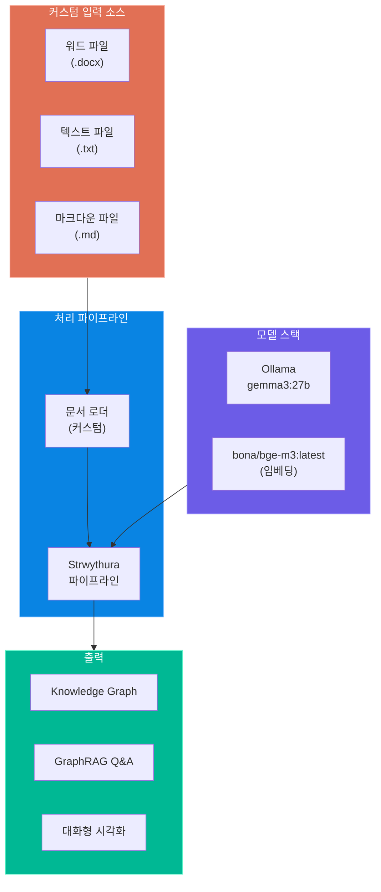

### 1.2 원본 vs 커스텀 구성 비교

| 항목 | 원본 (Strwythura 기본) | 커스텀 (활용 계획) | 변경 필요 여부 |
|------|----------------------|-------------------|--------------|
| **입력 소스** | HTML 웹페이지 (URL) | .docx, .txt, .md 파일 | **변경 필요** |
| **LLM** | Ollama gemma3:12b | Ollama gemma3:27b | 설정 변경 |
| **임베딩 모델** | LanceDB 내장 모델 (384차원) | bona/bge-m3:latest (1024차원) | **변경 필요** |
| **NLP 파이프라인** | spaCy en_core_web_md | spaCy (언어에 따라 변경) | 검토 필요 |
| **Entity Resolution** | Senzing SDK (gRPC) | 선택적 사용 | 검토 필요 |
| **벡터 저장소** | LanceDB | LanceDB (유지) | 차원 조정 |
| **시각화** | PyVis + Streamlit | PyVis + Streamlit (유지) | - |

---

## 2. 입력 소스 변환 전략

### 2.1 문서 로더 아키텍처

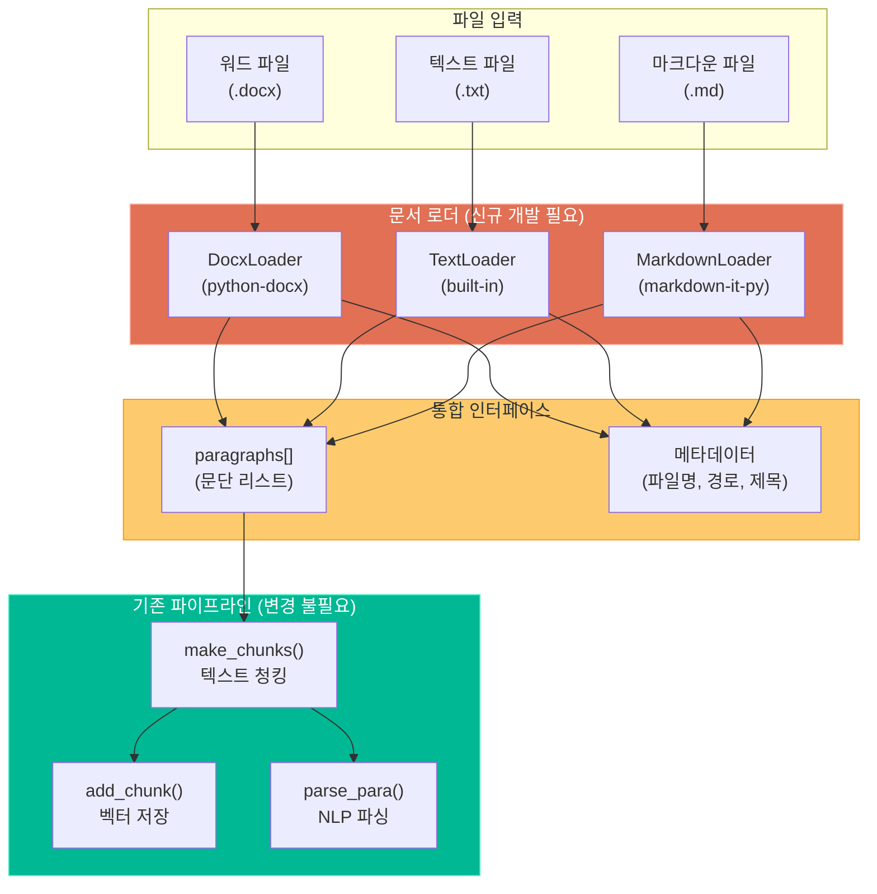

### 2.2 각 포맷별 로더 구현 검토

#### 워드 파일 (.docx)

| 항목 | 내용 |
|------|------|
| **라이브러리** | `python-docx` |
| **추출 대상** | 단락(paragraph), 표(table), 헤더(header), 목록(list) |
| **난이도** | 중간 |
| **주의사항** | 이미지/차트는 별도 처리 필요, 스타일 정보 활용 가능 |

```python
# 예시 구현 코드 (DocxLoader)
from docx import Document

class DocxLoader:
    def load(self, file_path: str) -> list[str]:
        doc = Document(file_path)
        paragraphs = []
        for para in doc.paragraphs:
            text = para.text.strip()
            if text:
                paragraphs.append(text)
        # 표 데이터도 텍스트로 변환
        for table in doc.tables:
            for row in table.rows:
                row_text = " | ".join(
                    cell.text.strip() for cell in row.cells
                )
                if row_text.strip("| "):
                    paragraphs.append(row_text)
        return paragraphs
```

#### 텍스트 파일 (.txt)

| 항목 | 내용 |
|------|------|
| **라이브러리** | Python 내장 |
| **추출 대상** | 줄 단위 또는 빈 줄 기준 단락 분리 |
| **난이도** | 낮음 |
| **주의사항** | 인코딩 감지 필요 (UTF-8, EUC-KR 등) |

```python
# 예시 구현 코드 (TextLoader)
import chardet

class TextLoader:
    def load(self, file_path: str) -> list[str]:
        with open(file_path, "rb") as f:
            raw = f.read()
            encoding = chardet.detect(raw)["encoding"] or "utf-8"

        with open(file_path, "r", encoding=encoding) as f:
            content = f.read()

        # 빈 줄 기준으로 단락 분리
        paragraphs = [
            p.strip() for p in content.split("\n\n")
            if p.strip()
        ]
        return paragraphs
```

#### 마크다운 파일 (.md)

| 항목 | 내용 |
|------|------|
| **라이브러리** | `markdown-it-py` 또는 `mistune` |
| **추출 대상** | 텍스트 블록, 코드 블록, 리스트, 헤더 |
| **난이도** | 중간 |
| **주의사항** | 코드 블록과 일반 텍스트 구분, 링크/이미지 참조 처리 |

```python
# 예시 구현 코드 (MarkdownLoader)
import re

class MarkdownLoader:
    def load(self, file_path: str) -> list[str]:
        with open(file_path, "r", encoding="utf-8") as f:
            content = f.read()

        # 코드 블록 제거 (선택)
        content = re.sub(r"```[\s\S]*?```", "", content)

        # 마크다운 문법 정제
        content = re.sub(r"#{1,6}\s+", "", content)  # 헤더
        content = re.sub(r"\[([^\]]+)\]\([^)]+\)", r"\1", content)  # 링크
        content = re.sub(r"[*_]{1,2}([^*_]+)[*_]{1,2}", r"\1", content)  # 볼드/이탤릭

        paragraphs = [
            p.strip() for p in content.split("\n\n")
            if p.strip()
        ]
        return paragraphs
```

### 2.3 Scraper 대체 전략

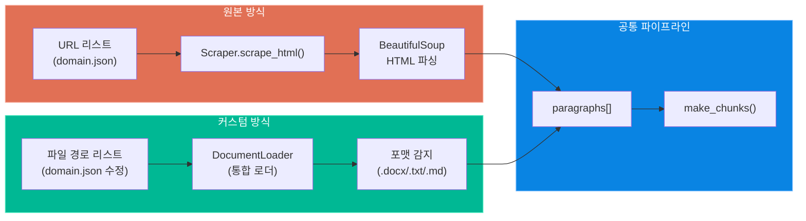

---

## 3. LLM 변경 검토: gemma3:27b

### 3.1 모델 비교

| 항목 | gemma3:12b (원본) | gemma3:27b (변경) |
|------|-------------------|-------------------|
| **파라미터 수** | 12B | 27B |
| **VRAM 요구량** | ~8GB (Q4) | ~16GB (Q4) |
| **추론 속도** | 빠름 | 중간 |
| **품질** | 양호 | 우수 |
| **다국어 지원** | 기본 | 향상 |
| **컨텍스트 윈도우** | 8K/128K | 8K/128K |

### 3.2 설정 변경 사항

```toml
# config.toml 변경
[rag]
# 변경 전
# llm_model = "gemma3:12b"

# 변경 후
llm_model = "gemma3:27b"
temperature = 0.0        # 결정적 응답 (유지)
max_tokens = 3000        # 최대 토큰 (필요시 증가)
```

### 3.3 gemma3:27b 적용 시 아키텍처

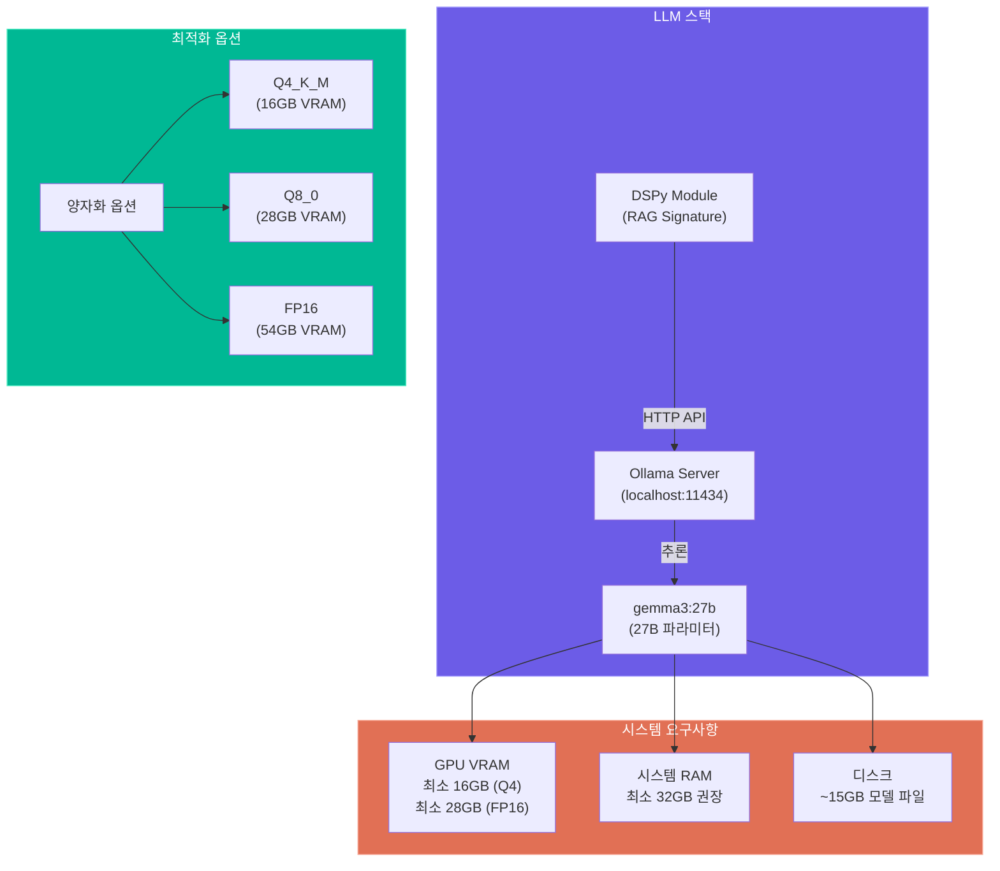

### 3.4 Ollama 설정 명령어

```bash
# gemma3:27b 모델 다운로드
ollama pull gemma3:27b

# 모델 실행 확인
ollama run gemma3:27b "Hello, test"

# 서버 상태 확인
curl http://localhost:11434/api/tags
```

---

## 4. 임베딩 모델 변경 검토: bona/bge-m3:latest

### 4.1 모델 비교

| 항목 | 원본 (LanceDB 내장) | bona/bge-m3:latest |
|------|---------------------|-------------------|
| **차원 수** | 384 | 1024 |
| **다국어 지원** | 제한적 | **100+ 언어 지원** |
| **한국어 성능** | 보통 | **우수** |
| **최대 토큰** | 512 | 8192 |
| **모델 크기** | ~100MB | ~2.3GB |
| **Dense 검색** | 지원 | 지원 |
| **Sparse 검색** | 미지원 | **지원** |
| **Multi-vector** | 미지원 | **지원 (ColBERT)** |

### 4.2 변경 영향도 분석

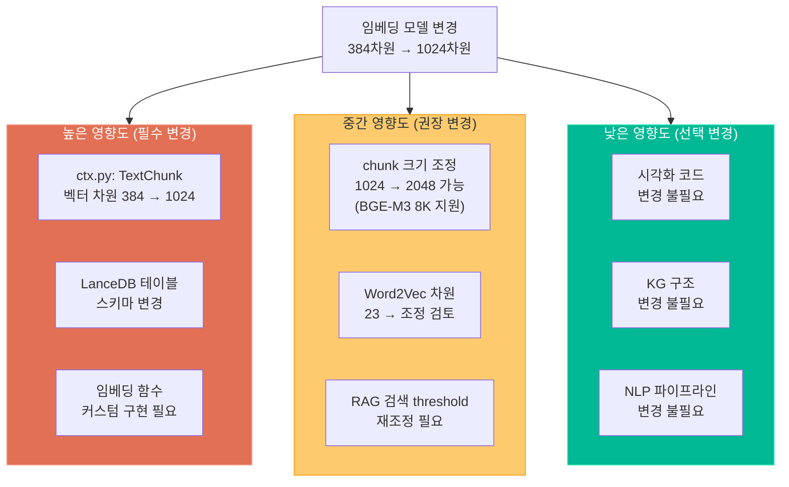

### 4.3 BGE-M3 통합 구현 방안

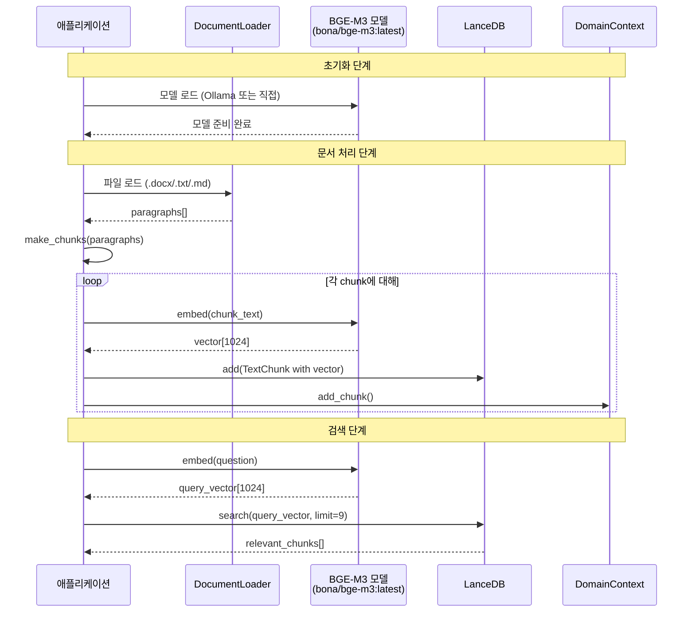

### 4.4 BGE-M3 Ollama 활용 설정

```bash
# BGE-M3 임베딩 모델 다운로드 (Ollama)
ollama pull bona/bge-m3:latest

# 임베딩 테스트
curl http://localhost:11434/api/embed \
  -d '{"model": "bona/bge-m3:latest", "input": "테스트 문장입니다."}'
```

```toml
# config.toml 변경 사항
[vect]
db_dir = "data/lancedb"
chunk_size = 2048          # 8K 토큰 지원으로 증가 가능
embed_model = "bona/bge-m3:latest"
embed_dim = 1024           # 384 → 1024
```

---

## 5. 코드 수정 필요 영역 상세 분석

### 5.1 수정 필요 파일 목록

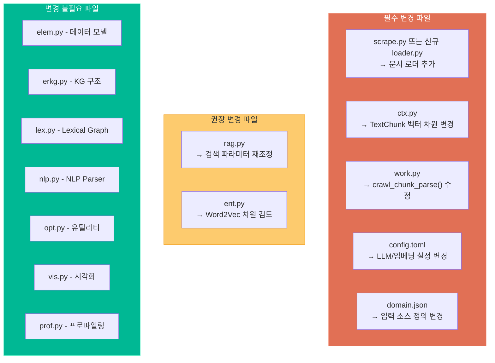

### 5.2 핵심 코드 변경 가이드

#### (1) ctx.py - TextChunk 벡터 차원 변경

```python
# 변경 전 (384차원)
class TextChunk(LanceModel):
    uid: int
    url: str
    sent_id: int
    text: str
    vector: Vector(384)  # 원본

# 변경 후 (1024차원 - BGE-M3)
class TextChunk(LanceModel):
    uid: int
    url: str
    sent_id: int
    text: str
    vector: Vector(1024)  # BGE-M3 차원
```

#### (2) work.py - 파일 기반 파이프라인 추가

```python
# crawl_chunk_parse() 수정 또는 새 메서드 추가
def load_file_parse(self, file_paths: list[str]):
    """파일 기반 문서 로드 및 파싱"""
    loader = DocumentLoader()

    for file_path in file_paths:
        paragraphs = loader.load(file_path)
        chunks = self.make_chunks(paragraphs)

        for chunk_text in chunks:
            self.dc.add_chunk(chunk_text, file_path)
            self.parser.parse_para(chunk_text, ...)
```

#### (3) domain.json 구조 변경

```json
{
    "domain": "my_project",
    "description": "프로젝트 설명",
    "lang": "ko",
    "sources": [
        {
            "type": "file",
            "path": "data/documents/report.docx",
            "format": "docx"
        },
        {
            "type": "file",
            "path": "data/documents/notes.txt",
            "format": "txt"
        },
        {
            "type": "file",
            "path": "data/documents/spec.md",
            "format": "md"
        }
    ],
    "taxonomy": "data/taxonomy.ttl"
}
```

---

## 6. 구현 로드맵

### 6.1 단계별 구현 계획

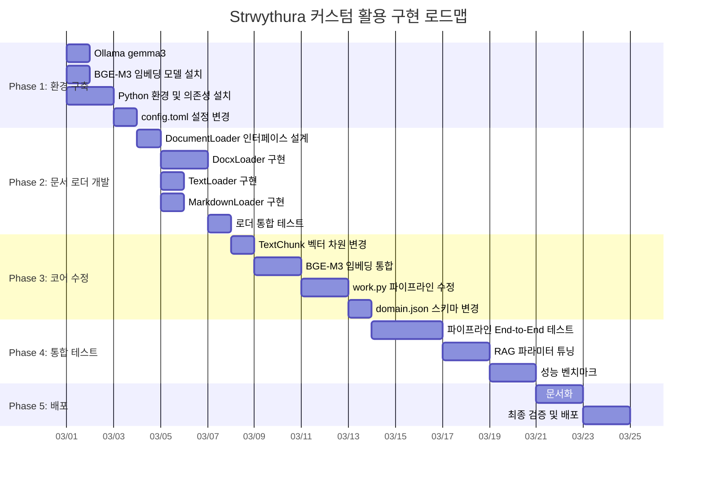

### 6.2 구현 우선순위 매트릭스

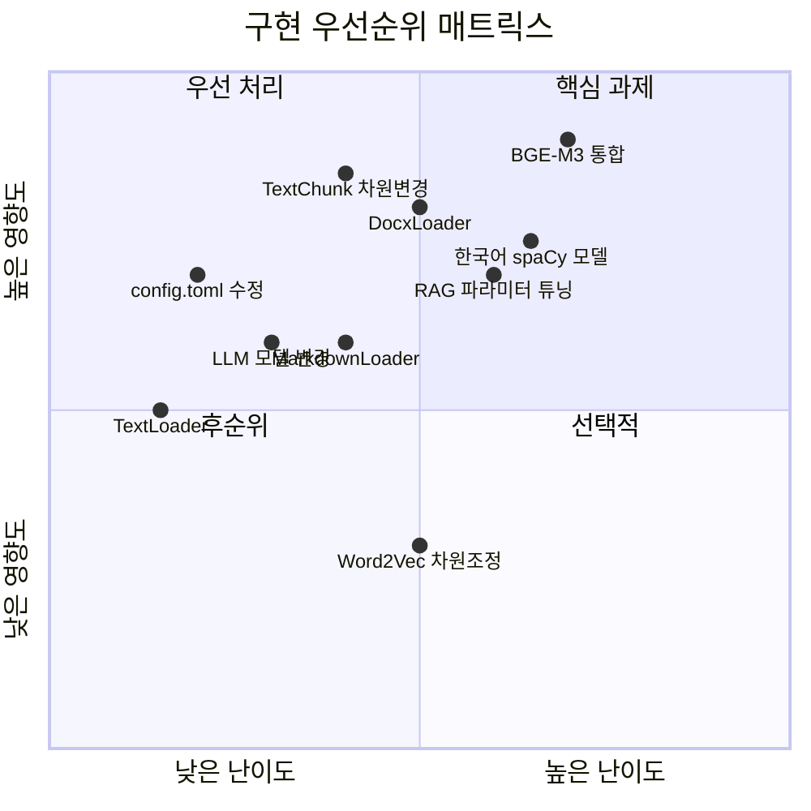

---

## 7. 리스크 분석

### 7.1 기술적 리스크

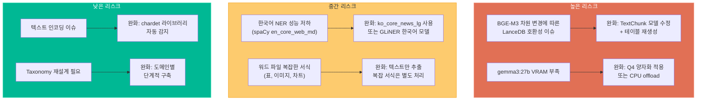

### 7.2 리소스 요구사항

| 리소스 | 최소 사양 | 권장 사양 |
|--------|----------|----------|
| **GPU VRAM** | 16GB (Q4 양자화) | 24GB+ |
| **시스템 RAM** | 16GB | 32GB+ |
| **디스크** | 50GB | 100GB+ |
| **CPU** | 8코어 | 16코어+ |
| **네트워크** | Ollama 로컬 실행 | - |

---

## 8. 한국어 지원 검토

### 8.1 한국어 NLP 파이프라인 옵션

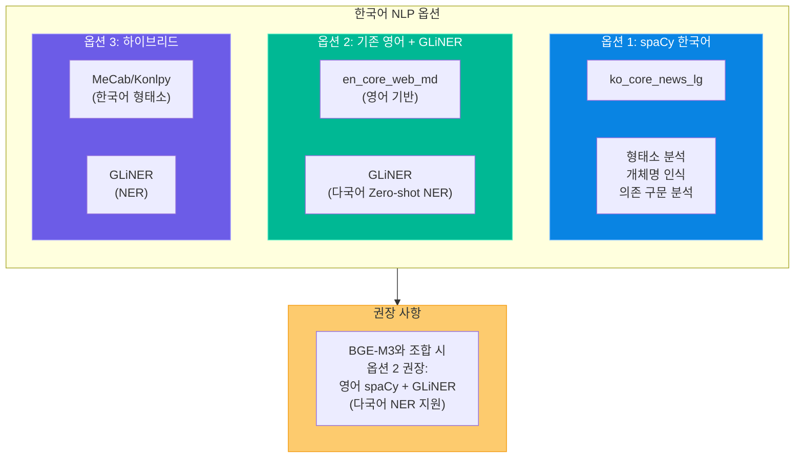

### 8.2 BGE-M3의 한국어 성능 장점

- **다국어 임베딩:** 100개 이상 언어에서 통합 벡터 공간 지원
- **한국어 최적화:** MTEB 벤치마크에서 한국어 검색 성능 우수
- **Cross-lingual:** 한국어-영어 간 교차 언어 검색 가능
- **긴 문맥:** 최대 8192 토큰 지원으로 한국어 긴 문서 처리 가능

---

## 9. 최종 아키텍처 (커스텀)

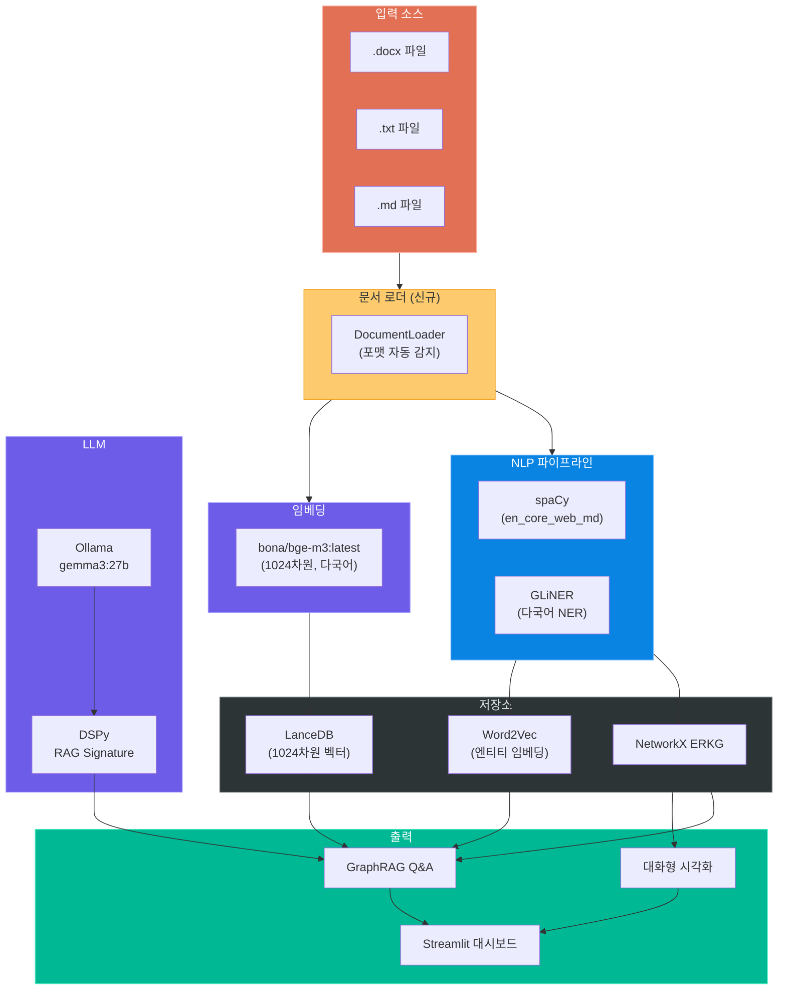

---

## 10. 체크리스트

### 구현 전 확인 사항

- [ ] Ollama 설치 및 gemma3:27b 모델 다운로드
- [ ] Ollama에서 bona/bge-m3:latest 모델 다운로드
- [ ] GPU VRAM 16GB 이상 확인
- [ ] Python 3.11~3.13 환경 구성
- [ ] Strwythura 의존성 설치 (poetry install)

### 코드 변경 확인 사항

- [ ] config.toml: llm_model을 gemma3:27b로 변경
- [ ] config.toml: 임베딩 관련 설정 추가
- [ ] ctx.py: TextChunk 벡터 차원 384→1024 변경
- [ ] 문서 로더 모듈 구현 (loader.py)
- [ ] work.py: 파일 기반 파이프라인 메서드 추가
- [ ] domain.json: 파일 소스 구조로 변경

### 테스트 확인 사항

- [ ] 각 포맷별 문서 로더 단위 테스트
- [ ] BGE-M3 임베딩 벡터 생성 확인
- [ ] LanceDB 테이블 정상 생성 확인
- [ ] 전체 파이프라인 End-to-End 실행
- [ ] GraphRAG Q&A 품질 검증
- [ ] Streamlit 앱 정상 동작 확인

이 문서는 Strwythura를 커스텀 환경(워드/텍스트/마크다운 입력, gemma3:27b, BGE-M3)에서 활용하기 위한 종합적인 계획 검토 자료입니다.
